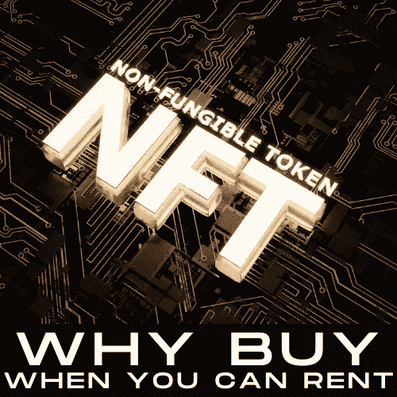

# 你现在可以租用 NFT

> 原文：<https://medium.com/coinmonks/you-can-now-rent-an-nft-149a9210734a?source=collection_archive---------15----------------------->

Source, Author, 2022

# 但你为什么要这么做？

[NFT，或不可替代的令牌](https://open.spotify.com/episode/5L1M1fsW3se4Jv6w4hxGIe)，有效地代表存储在区块链上的**数据。[可替代的](https://en.wikipedia.org/wiki/Fungibility)是一个金融术语，表示两种不同的资产可以相互替代。那是什么意思？**

有一次，我欠我的经纪人 5 万美元。我没有现金，但我有价值 5 万美元的短期国库券。她愉快地接受了国债来解决我的债务，作为短期美国政府…