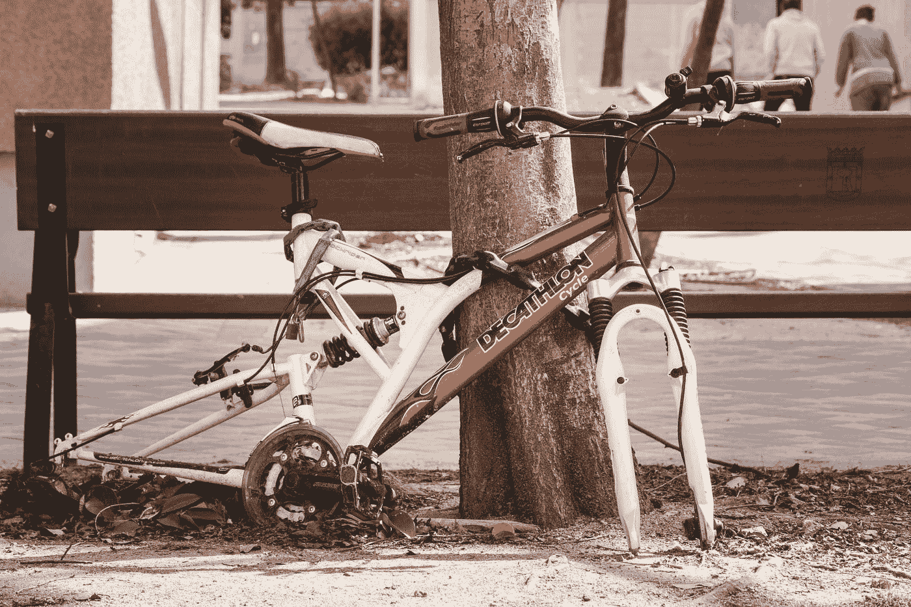

# 你并不完全拥有你的 NFTs

> 原文：<https://medium.com/coinmonks/you-do-not-completely-own-your-nfts-a571ec596667?source=collection_archive---------3----------------------->

## [NFT 系列](/@donpablooooo/list/nft-series-34dea60327e7)

## 认识到 NFT 和瑞士联邦理工学院所有权之间的区别。

Photo by [Jose Antonio Gallego Vázquez](https://unsplash.com/@joseantoniogall?utm_source=medium&utm_medium=referral) on [Unsplash](https://unsplash.com?utm_source=medium&utm_medium=referral)

考虑在 OpenSea 上购买一个非常昂贵的 NFT，例如 [Bored Ape #8585](https://opensea.io/assets/ethereum/0xbc4ca0eda7647a8ab7c2061c2e118a18a936f13d/8585) ，在撰写本文时，它现在的售价为 777，7 ETH(1 . 217 . 971，52 美元)。