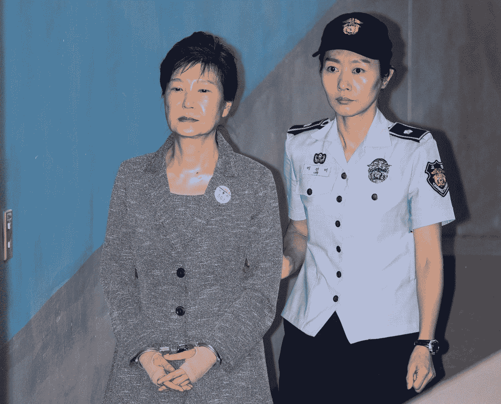
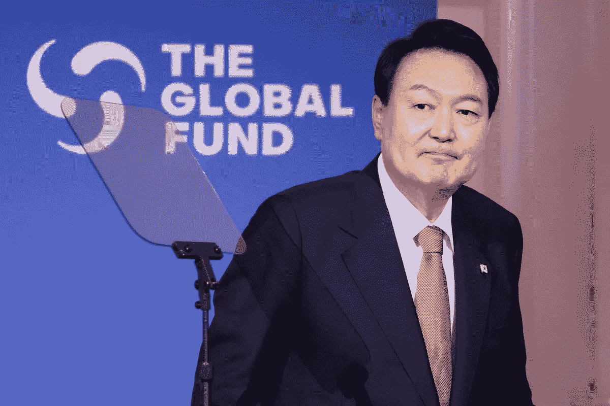

# 你可能很重要，但你“被总统赦免以拯救整个半导体行业”重要吗？

> 原文：<https://medium.com/coinmonks/you-might-be-important-but-are-you-presidentially-pardoned-to-save-the-entire-semiconductor-ce320180ca88?source=collection_archive---------34----------------------->

Samsung Leader Jay Y. Lee Granted Presidential Pardon.

我找到了一个比整个国家更重要的人

韩国司法部表示，三星电子(Samsung Electronics)副董事长杰伊·y·李(Jay Y. Lee)将获得总统特赦，这为这家韩国最大公司的继承人重新掌权铺平了道路。

你的杯子掉了吗？

随着所有的加密新闻和市场暴跌，你可能不记得了，所以让我刷新你的记忆。

几年前，韩国总统朴槿惠卷入了一桩巨大的丑闻。

Former South Korean President Park Geun-hye Handed 24-Year Jail Sentence For Corruption.

作为韩国第一位女总统，她创造了几项纪录和第一。

她是东亚有史以来第一位女性国家元首。

她也是亚洲第一位在任时被弹劾的总统。

2018 年，她因腐败和滥用职权被判处 30 年至 20 年监禁，并被罚款 180 亿韩元。

这也没有持续太久，她在 2021 年被赦免并以同情的理由释放。

令人惊讶的是，对于这样一个秩序井然、普遍守法的国家，韩国有着腐败政客、政府中的坏蛋和违法领导人的悠久历史。

那起大丑闻牵涉到杰伦，他被发现贿赂帕克。

真的吗？

韩国最大最有权势公司的继承人给韩国总统送礼。

我们怎么能相信这样的事情不会或不可能发生呢？

这不是惯例吗？

As of October 2022 Samsung has a market cap of $**261.24 Billion**. This makes Samsung the world’s 28th most valuable company by market cap.

显然，周杰伦对韩国如此重要，他们真的给他总统特赦，把他带出监狱，抹去所有犯罪记录，让他掌管三星(如果我们诚实的话，还有整个国家)，在这个过程中让每个人都哑口无言。

因此，由于供应短缺、通货膨胀等原因，半导体行业正处于水深火热之中。

可悲，但真的，谁不痛苦呢？

我的意思是，从一个被判有罪的罪犯在全国人民面前受辱，到把控制权交还给历史上最大的公司之一，并让总统软求他回来。

这是多大的弹性？

一个人真的能对一个国家这么重要吗？

我的意思是，即使他真的对一个国家的生存至关重要，这能得到总统的赦免吗？

我们就不能把他带出监狱几个月，等情况解决了再把他放回去吗？

既然现在在家工作很流行，他就不能在监狱里为三星提供咨询吗？

The current president, **Yoon Suk-yeol**, a former Prosecutor General and member of the conservative People Power Party, assumed office on 10 May 2022.

是这种不公平的做法一直蔓延到韩国社会的最高层，还是杰伦是一个假仁假义的人物，对韩国的生存至关重要？

不管怎样，这都是一个悲惨的局面。

这反映了韩国作为一个国家的不良形象，以及他们对一个人的依赖程度。

我努力做到客观，但除了杰伦，我看不到任何人的公正和进步。

我遗漏了积极的一面吗？

任何人都不应凌驾于法律之上。

还是我错了？

-

三星创始人的孙子 Jay Y Lee 应该被赦免吗？

-

#创业#商业#创业#成长#成功#社交媒体#文化#网络 3 #三星# jaylee #假释#总统#总统#韩国#韩国#半导体

> 交易新手？试试[加密交易机器人](/coinmonks/crypto-trading-bot-c2ffce8acb2a)或者[复制交易](/coinmonks/top-10-crypto-copy-trading-platforms-for-beginners-d0c37c7d698c)