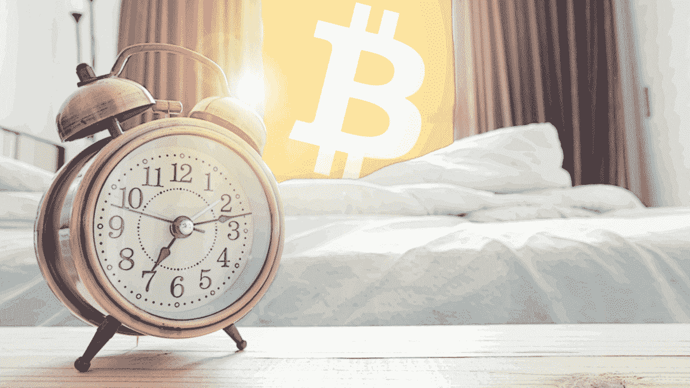

# 你需要脱离加密

> 原文：<https://medium.com/coinmonks/you-need-a-break-from-crypto-d5cad03dd857?source=collection_archive---------26----------------------->

Credit — [Bitcoin.com](https://news.bitcoin.com/another-sleeping-bitcoin-block-reward-from-2010-was-caught-waking-up-after-ten-years/)

我们都被丑闻、爆料和对秘密空间的评论淹没了。我不会浪费你的时间重复过去一个月的负面新闻。这一年你已经读够了。

我们中的许多人都动摇了自己的加密信念，朋友和家人问我们怎么会如此愚蠢地在如此疯狂的领域投资。那么如何应对这个动荡的时代呢？

休息一下。

我的意思并不是说匆忙卖掉你的代币，以后再回来。不，我是说休息一下。加密空间以疯狂的速度运行，我们每天都试图跟上它。

秘密节食。

我们即将进入十二月，这是一年中最喜庆的月份之一。这是一个与家人和朋友团聚的时刻，是一年结束的时候，是反思的时候，是为新的一年设定目标的时候。那么为什么不在这个月忽略 crypto 呢？给你的思想一些自由。

我知道这很可怕。但空间不会去任何地方，加密不会错过你。相信我。

# 秘密饮食

好吧，让我们先去掉一些显而易见的东西。以下都需要去:

1.  加密价格应用程序(我们都有一个)。
2.  推特——最嘈杂的地方。
3.  加密新闻网站。将它们从您的搜索历史记录和 cookies 中删除。
4.  YouTube——如果你还想使用这个平台，请匿名使用，这样你就不会被推荐任何与加密相关的 FUD 视频
5.  不和。我知道许多人都是充满活力和相互支持的社区的一员。但是这些并不是不受负面新闻和信息快速自由流动的影响。告诉人们你会休息一段时间，然后在新的一年回来。他们会理解的。
6.  时事通讯。您不需要取消订阅您最喜爱的时事通讯，只需将它们全部集中在一起并隐藏起来。你可以在新的一年回到他们身边。为此，我使用了类似于 [Mailman](https://mailmanhq.com/) 的工具。

这个列表，或者它的一些变体，应该让你在减少噪音方面有一个好的开始。12 月之后，它甚至可能会彻底改变你对信息流的看法。我们真的每天都需要这一切吗？大概不会。

但是减少噪音并不是它带给你的唯一好处。

通过从 crypto 提供的持续不断的信息冲击中休息一下，你终于给了你的大脑一个放松和消化你今年所学的一切的机会。这段休息时间会让你的大脑处理所有的事情，把事情联系起来。我想你会发现，你对加密的看法开始转变。你可能会改变对空间的看法，或者开始更清楚地看待事物。这种饮食甚至可能会让你在新的一年里产生新的想法。

如果没有别的事，它只会对你的心理健康有好处。对于那些在 web3 工作的人来说，我建议制作一个以上列表的变体，尽管我知道你负担不起完全检查。

# 预测 2023 年

我知道现在写年终文章有点早。但是提前退房，至少从 crypto 来说，是一个值得尝试的事情。只需将您的代币锁入[硬件钱包](https://www.ledger.com/)(安全第一！)也就作罢了。

该行业需要时间来解决 FTX 危机的影响，老实说，是整个一年的影响。给它时间去做那件事。新的一年将会有很多有趣的事情发生。利用这段时间为即将到来的事情做好准备。

不过，给你个警告。如果你秘密节食并在一月份回来，不要期望尘埃落定。一个月的时间对于行业和监管者来说是不够的，他们需要仔细检查已经发生的一切。在情况好转之前，情况还可能变得更糟。但至少你能以更清晰的思维迎接新的一年。

Crypto 经历了有史以来最艰难的一年。如果你安然度过了 2022 年，我怀疑你会轻松度过新的一年。

# 有目的地开始新的一年

对于我们大多数人来说，我们只是陷入了密码流，让它带我们去任何地方。就像一条无情的河流，把我们拖着走，没有逃脱的机会。为什么不让新的一年与众不同呢？以更大的谨慎进入它。制定一个计划。有目的地开始新的一年。

什么计划？

为你感兴趣的事情做计划。你想关注的领域。如果你正在读这篇文章，你很可能至少在 2022 年的大部分时间里都在从事加密工作。你要有足够多的数据点来了解你对这个领域感兴趣的是什么，不太感兴趣的是什么。用这个来设定你在新的一年想要关注的地方。

理解加密中的一切是不可能的。想都别想。

你是一个缺乏自信的人吗？你是交易员吗？要不要关注一下最有意思的亲民合集和空投？你是音乐投资者吗？或者第二层和可伸缩性是您感兴趣的领域吗？不管是什么，在新年之前设定你的目标，并检查你的信息流，以确保它们符合这个目标。我知道这可能是限制性的，FOMO 可能会踢一点。但是我们的大脑只能处理这么多。相信我，你不会错过你想的那么多。无情的秘密之河最终会找到方法把你拉进它的水流中。这只是一个确保你更有意识地进入新的一年的措施。

开始你的秘密年，就像它是故意的一样！✅

我认为你会从中获益匪浅。请在评论中告诉我你的新年秘密策略。我很想听听！

> 交易新手？试试[密码交易机器人](/coinmonks/crypto-trading-bot-c2ffce8acb2a)或者[复制交易](/coinmonks/top-10-crypto-copy-trading-platforms-for-beginners-d0c37c7d698c)