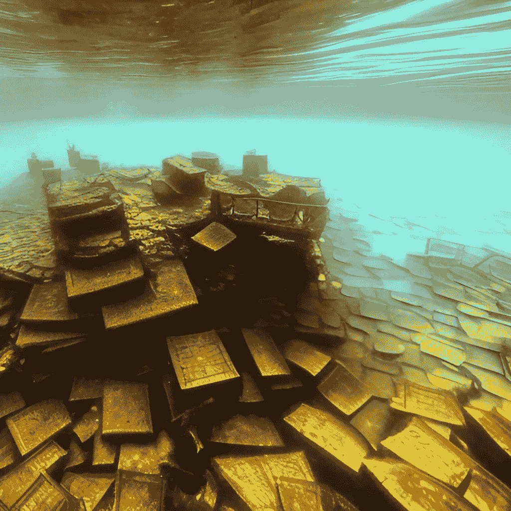

# 您的加密投资已经入不敷出，现在该怎么办？

> 原文：<https://medium.com/coinmonks/your-crypto-investment-is-underwater-what-now-f943090fe6ed?source=collection_archive---------4----------------------->

许多加入我的荷兰加密社区( [CryptoCoiners.nl](https://www.cryptocoiners.nl/) )的人承认，只有当价格已经升至历史高点时，他们才对比特币加密感兴趣，并开始投资加密资产。其结果是，他们的投资组合现在处于“水下”。

## 非常重要的免责声明