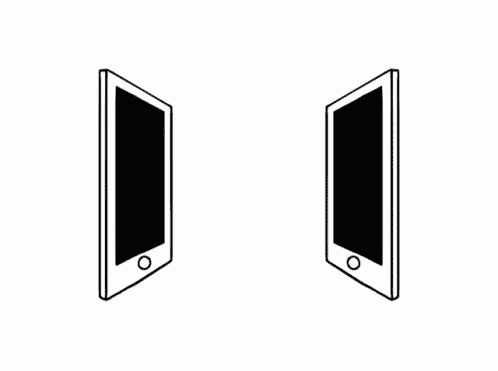
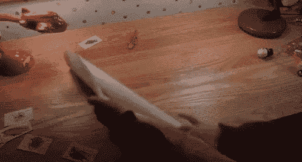
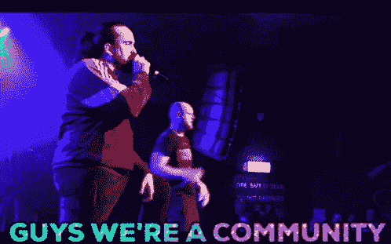
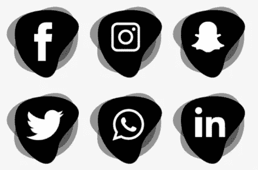
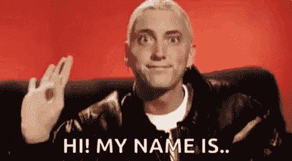

# 你的网络终极指南 3

> 原文：<https://medium.com/coinmonks/your-ultimate-guide-to-networking-in-web3-f29c963536f8?source=collection_archive---------11----------------------->

众所周知，没有人是一座孤岛，因此，知识永远无法通过孤独的生活方式获得。总是需要建立关系网，结识新朋友，从他们的经历中学习，并与他人建立良好而持久的关系。

Web3 技术是一项创新，它提供了无数充满活力的机会。这令人大开眼界，向用户展示了一个去中心化的互联网应该是什么样子，一个人们可以在不需要牺牲所有权或身份的情况下进行互动的互联网。考虑到其多样化的生态系统，试图完全理解和利用(受益于)Web3 的整个概念可能是对任何敢于这样做的人的大脑屠杀——因此需要网络化。

建立关系网是建立和保持积极互利关系的过程。它不应该被误放在垃圾邮件、跟踪和荒谬地寻求关注的地方，因为许多人将后者混淆为前者，从而无法实现他们的网络目标。

人际交往是一项经常被忽视的基本技能，许多人看不到与人交往的必要性，而那些认识到这一点的人通常以错误的方式结束。网络不仅有助于建立销售线索，也是启动你的想法(或在 Web3 中启动你的职业生涯)的最快方式。

**如何在 Web3 中建立正确的关系网**

# **有计划**:

“没有计划的目标只是一个愿望”——安东尼·德·圣埃克苏佩里。规划对于任何一个网络工作者(无论是初学者还是专业人士)都是必要的。首先，规划给出了要实现的目标的更清晰的愿景，并有助于预见潜在的问题并解决它们。这是许多人容易忽视或花很少时间的基本阶段。没有适当的计划，什么也做不成。

以下是如何制定计划的方法

1.)拿一张纸，写下你拥有的价值观(可能是平面设计、写作、编码等等。).

2.)写出你想与之交往的人的类型。是你圈子里的人还是你圈子里的精英？

3.)选择你打算如何与他们交往；Twitter、LinkedIn、Telegram、Discord 或线下事件。

4.)定目标。结局应该是怎样的？

5.)扪心自问，这个人为什么会想和我套近乎？这将是一个现实检查，以预见任何潜在的问题，并有助于构建您的计划。

# **加入社区**:

Web3 主要由社区驱动。这些可能是电报组、Discord 服务器、subreddits 和其他充满了 web3 爱好者的社交平台，他们分享想法，互相教育和启发。对于任何想要深入 Web3 生态系统的人来说，社区是第一选择。

加入社区会让你接触到各种各样的人，但是为你所在的社区提供价值才是你的优势。

**以下是如何在**中为你所属的任何社区增值的方法

1.)要积极。不要鬼！

2.)确保你给的是社区需要但缺乏的东西。对于大多数 web3 社区来说，总是需要跟上最新的技术创新。你可以提供这样的信息。

3.)让社区成员参与到社区中。你不想被视为垃圾邮件发送者，你想被认为是有价值的人。让成员参与进来的一个简单方法是提出开放式问题，让社区中的每个人都有机会表达自己的想法，不管他们的想法是对是错。开放式问题的一个例子可能是:“Web3 的潜在缺点是什么”，以及“web3 中黑客/骗子的最新计划是什么”。

4.)要始终如一。

# **积极参加各种社交活动**:

拥有一个社交账户是一个方面，持续不断地创造内容完全是另一个方面。通常，人们不认为有必要在他们的社交手柄上发布内容，因为他们没有被标记为“影响者”。

活跃的社交活动不仅有助于建立个人品牌形象，还能证明你技能专长的可信度。你创造得越多，参与得越多，就越容易与他人联系。

# **掌握冷 DM 的艺术:**

引起任何人注意的最简单的方法就是直接给他们发信息。与冷冰冰的电子邮件不同，DM 不那么正式，给发件人留有空间，以个人的方式表达自己。

如果你使用 Twitter 或 LinkedIn 发送一条冷冰冰的 DM，确保你已经建立了一个社交关系(第三点),因为它会让收件人更容易通过你的社交信息更好地了解你(发件人)。

虽然向任何人发送冷 DM 很容易，但要正确地做到这一点相当困难，因为冷 DM 只是垃圾邮件的礼貌版本。下面介绍如何成功发送一条冷 DM

1.)研究一下你在给谁发信息。他们是什么样的人，他们在自己的领域取得了什么成就，是什么让他们与众不同，等等？这有助于在你的信息中添加赞美。

2.)确保你关注他们的社交活动，关注他们的帖子(如赞、评论等)。).这将更容易得到回应。

3.)自我介绍一下。保持简单，也要揭示你是如何进入他们的收件箱的。

4.)表达你给他们发信息的原因。这可能是因为他们的资质、成就或个人品牌风格。不管是什么，确保你是诚实的。

5.)提供一个自己经历的背景。举个例子，你是一个新手开发人员，试图和一个有经验的从业者交流，说明你为什么选择这个领域的工作，以及你到目前为止取得的进展。

6.)详细说明你为什么希望与他们建立联系。根据你发信息的对象和原因，确保你具体说明你希望从这种联系中获得什么。

7.)用一个能引发对话的基本问题来结束你的信息。用第五个例子，结束你的 DM 的一个好方法是；“我很想知道，你看到年轻的开发人员一直在犯什么错误？”

8.)使用清晰简洁的语法。推荐的工具有 Grammarly 和 copy ai。

# **开始小**:

这都是一个需要逐渐经历的过程。从与你所在领域中比你更有经验的人建立联系开始，这样你就更容易与你所在领域的精英建立联系。

就像其他技能一样，网络必须经过学习、实践和不断发展才能被完美掌握。不要羞于或害怕每天建立新的联系。**从今天开始！**

> 加入 Coinmonks [电报频道](https://t.me/coincodecap)和 [Youtube 频道](https://www.youtube.com/c/coinmonks/videos)了解加密交易和投资

# 另外，阅读

*   [NFT 十大市场造币集锦](https://coincodecap.com/nft-marketplaces)
*   [AscendEx Staking](https://coincodecap.com/ascendex-staking)|[Bot Ocean Review](https://coincodecap.com/bot-ocean-review)|[最佳比特币钱包](https://coincodecap.com/bitcoin-wallets-india)
*   [Bitget 回顾](https://coincodecap.com/bitget-review) | [双子星 vs BlockFi](https://coincodecap.com/gemini-vs-blockfi) | [OKEx 期货交易](https://coincodecap.com/okex-futures-trading)
*   [美国最佳加密交易机器人](https://coincodecap.com/crypto-trading-bots-in-the-us) | [经常性回顾](https://coincodecap.com/changelly-review)
*   [在印度利用加密套利赚取被动收入](https://coincodecap.com/crypto-arbitrage-in-india)