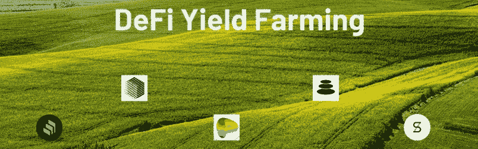

# 你的终极指南:高产农业

> 原文：<https://medium.com/coinmonks/your-ultimate-guide-to-yield-farming-a09408687cc5?source=collection_archive---------27----------------------->

亲爱的无名氏:

> 如果你已经在密码领域呆了一段时间，即使是作为一个初学者，你一定会遇到“产量农业”这个术语，并对自己说“*…那究竟是什么…”。*别担心，我会带你了解所有你需要了解的关于高产农业及其方法的基础知识，哦*-请把你的农具放在谷仓里😉*

**Yield farming** 是一种获得更多加密货币的方法，通过将现有资产临时借给 DEFI 平台，例如分散式交易所或借贷协议，作为回报，用户赚取平台费用和特殊的流动性池令牌。只要产量耕作过程是活跃的，用户就会累积费用。产量农民试图通过在多种不同策略之间切换来追求最高产量。最有利可图的策略通常涉及至少几个 **DeFi** 协议，如 Compound、Curve、Synthetix、Uniswap 或 Balancer。如果这种策略不再奏效，或者有更好的策略可用，收益农民就会转移他们的资金。例如，他们可能会在不同的协议之间转移资金，或者他们可能会将一些硬币交换到目前产生更多收益的其他硬币上。确切的回报由流动性池的 APY 决定，这是一种随着流动性池的活动和代币价值而变化的利率。

简而言之，收益耕作协议激励 [**流动性提供者**](https://coinmarketcap.com/alexandria/glossary/liquidity-provider)**【LP 的】**在基于 [**智能合约**](https://coinmarketcap.com/alexandria/glossary/smart-contract) **的流动性池中入股或锁定其加密资产。**

yield farm 的主要目标是通过奖励愿意出借资产的投资者来吸引流动性，通过这样做，这些资产可以重新分配给对使用这些资产、产品和服务感兴趣的客户，最终从用户交易中获得的一部分费用用于偿还 yield farm。

*   产量农场通过智能合同实现自动化，因此，它们通常风险较低或中等，但当然仍存在安全风险
*   这需要大量的持续跟踪和研究。
*   由于价格波动、拉地毯、精明的合同黑客等原因，高产农业可能是一种有风险的做法。

**风险:**中等至德根。

> 交易新手？尝试[加密交易机器人](/coinmonks/crypto-trading-bot-c2ffce8acb2a)或[复制交易](/coinmonks/top-10-crypto-copy-trading-platforms-for-beginners-d0c37c7d698c)

APY 的高产农业是什么？

产量农民，以及大多数协议和平台，根据**年百分比产量** (APY)计算估计回报。APY 是特定投资在一年中获得的回报率。定期计算并应用于金额的复利计入 APY。

流行的产量农业协议？

[Aave](https://coinmarketcap.com/exchanges/aave/)

[复合](https://coinmarketcap.com/exchanges/compound/)

[曲线金融](https://coinmarketcap.com/exchanges/curve-finance/)

[Uniswap](https://coinmarketcap.com/exchanges/uniswap-v3/)

[平衡器](https://coinmarketcap.com/currencies/balancer/)

[SushiSwap](https://coinmarketcap.com/exchanges/sushiswap/)

[PancakeSwap](https://coinmarketcap.com/exchanges/pancakeswap/)

[向往.金融](https://coinmarketcap.com/currencies/yearn-finance-protocol/)

[金星协议](https://coinmarketcap.com/exchanges/venus/)

**高产养殖类型:**

*   流动性提供者:用户将两枚硬币存入 DEX 以提供交易流动性。交易所收取少量费用来交换这两种代币，并支付给流动性提供者。这项费用有时可以用新的流动性池(LP)代币支付。
*   贷款:硬币或代币持有者可以通过智能合同将 crypto 借给借款人，并从贷款利息中获得收益。
*   借贷:农民可以用一个代币作为抵押，获得另一个代币的贷款。然后，用户可以用借来的硬币耕种。通过这种方式，农民保留了他们最初持有的硬币，随着时间的推移，这些硬币可能会增值，同时也从他们借来的硬币中获得收益。
*   赌注:在 DeFi 的世界里有两种形式的赌注。主要的形式是在区块链，用户向网络抵押他们的令牌以提供安全保障。第二种是用流动性来抵押从提供 DEX 中获得的 LP 代币。这使得用户可以赚取两倍的收益，因为他们为 LP 代币提供流动性而获得报酬，然后他们可以下注以赚取更多的收益。

流动性挖掘:这只是向协议用户分发令牌的实践。它为高产农民创造了额外的激励，因为象征性的奖励是在使用某种协议已经产生的产量之上增加的。在 Compound 开始向其平台用户发布暴涨的 [COMP，](https://coinmarketcap.com/currencies/compound-coin/social/)其治理令牌之后，它变得突出起来。

**战略**

——跑马圈地(USDT、戴、等。)

-下注 LP 代币

-贷款/借款

-提供资本流动性

**需要注意的是，策略很快就会过时，因此轮作是必要的。*

**从哪里获得农场产量排名？**

CoinMarketCap 的 [DeFi Yield Farming Rankings](https://coinmarketcap.com/yield-farming/) 是一个很好的地方，可以获得一个指数，供各州跟踪流动性池，因为它也索引加密对、[总价值锁定](https://coinmarketcap.com/alexandria/glossary/total-value-locked-tvl) (TVL)、奖励类型、非永久性损失和 APY。

**产量养殖有风险吗？**

投资者在开始种植之前应该了解高产农业的诸多风险，这对 always DYOR 至关重要。

**地毯拉手**

Rug Pulls 是一种退出骗局，加密货币开发商为一个项目收集投资者的现金，然后放弃它，不向投资者偿还资金。根据 CipherTrace research [的一份报告](https://ciphertrace.com/2020-year-end-cryptocurrency-crime-and-anti-money-laundering-report/#summary)，拉地毯和其他出口诈骗(农民特别容易受到这些诈骗的影响)占 2020 年下半年大型诈骗案的 99%左右。

**监管风险**

加密货币监管仍笼罩在不确定性之中。美国证券交易委员会(Securities and Exchange Commission)宣布，一些数字资产是证券，将其置于其管辖范围内，并允许其对其进行监管。州监管机构已经对 BlockFi、Celsius 等集中式加密贷款网站发布了停止令。如果 SEC 宣布 DeFi 借贷生态系统为证券，它们可能会受到打击。

虽然这是事实，但 DeFi 被设计为不受任何中央权威机构的约束，包括政府法规。

**智能合约黑客/漏洞**

与高产农业相关的大多数危险都与支撑它们的智能合同有关。这些合同的安全性正在通过更好的代码审查和第三方审计得到改善，然而，DeFi 中的漏洞和黑客攻击仍然很常见。

**波动性**

波动性是指投资价格向两个方向变动的程度。波动性投资是指短期内价格波动较大的投资。当代币被锁定时，它们的价值可能会下降或上升，这对收益农民来说是一个巨大的风险，尤其是当秘密市场经历熊市时。

**无常的损失**

这是收益农业特有的风险，当资产经历波动性的巨大峰值时，就会发生这种风险，如果资产价值上升，通过简单的 HODL 令牌就可以赚更多的钱……另一方面，如果资产价值下降，也会遭受损失，因为收益率将太小，不足以抵消损失。非永久性损失类似于机会成本的概念

**需要注意的条款**

*   杠杆(过度抵押贷款):在这里，你存入硬币作为抵押来借其他硬币，用借来的硬币作为进一步的抵押来借更多的硬币……(非常高的风险)

*不言而喻，这不是对任何项目的认可，也不应被解释为投资建议。本指南仅用于教育目的。永远做你自己的研究。*