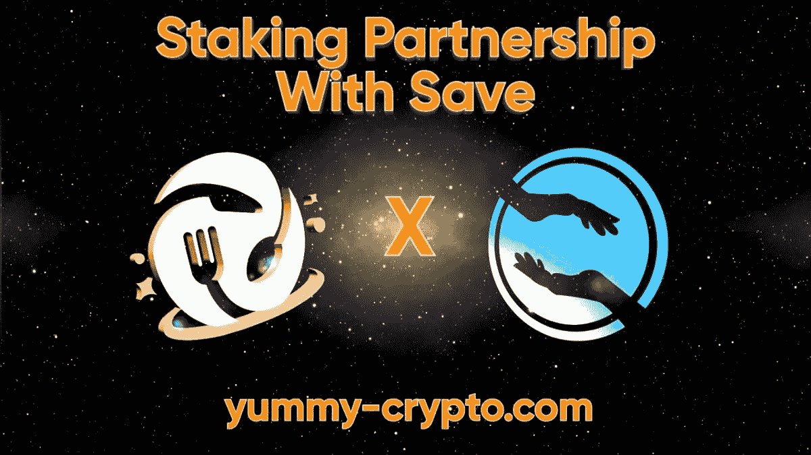

# 美味更新— 05

> 原文：<https://medium.com/coinmonks/yummy-update-05-c1198b0d919b?source=collection_archive---------12----------------------->

亲爱的社区:

我们很高兴再次见到大家！让我们在这次更新中带给你最新的美味！

此版本:

*   新闻更新
*   保存迁移公告
*   成长型基金撤资进入 BNB
*   90 天金库奖励公告
*   90 天保险库结束
*   增长基金资本公告
*   每周风险投资投票结果
*   保存桩池开口
*   NFT APR 推进空投公告
*   美味的统计
*   YUSD 统计
*   打桩平台统计
*   增长基金统计
*   第七届篝火活动结果

🔸新闻更新🔸

自上次更新以来，市场对项目的需求更加枯竭。Celsius 即将彻底崩溃，其他公司很可能会紧随其后。越来越明显的是，我们正处于熊市，短期前景并不乐观。众所周知，7 月和 8 月对 crypto 来说都是糟糕的月份。但另一方面，crypto 有机会在一夜之间将它的全部情感…

显然这不会减慢美味团队的速度。我们完全打算继续工作，继续努力，尤其是在这样的艰难时期。要让 Cinder 真正运转起来，市场需要变坏，让更多的项目接受我们的提议。

> 交易新手？试试[加密交易机器人](/coinmonks/crypto-trading-bot-c2ffce8acb2a)或者[复制交易](/coinmonks/top-10-crypto-copy-trading-platforms-for-beginners-d0c37c7d698c)

自上次更新以来，我们已将所有增长基金资本转移到 BNB，并将其中大部分转移到币安的 validator staking。截至目前，约有 4，021 名 BNB 人被转移。

也就是说，保存迁移已全面启动，保存赌注池也已启动。

我们 90 天的金库结束了，又一批 NFT 炸弹被空投下来。

我们还在 TG 会议室举行了一次社区投票，以决定我们将在哪天和什么时候举行每周一次的 AMA 团队活动。

🔸保存迁移公告🔸

拯救 V2 的大迁徙于 6 月 16 日下午 1 点正式开始。est！使用 Yummy 门户上的 swap 迁移到 V2。👇🏻👇🏻👇🏻

[交换页面](https://www.staking.yummy-crypto.com/exchange)

要将“保存 V2”添加到您的钱包中:

合同:0x 10 CDB be 9 b 9 e 2163 ce 93 d9 a 79 C4 d 46 b 388582 d0b 6
符号:保存
小数:9

关于如何使用交换的完整教程可以在下面的文章中找到:

[https://medium . com/@ YummyCrypto/how-to-migrate-save-v1-to-v2-efc2ff 43158d](/coinmonks/how-to-migrate-save-v1-to-v2-efc2ff43158d)

仅使用官方管理员在保存电报或官方 Twitter 页面中提供的链接！其他所有链接都应该被认为是假的！

如果您在迁移过程中遇到任何问题，请联系具有以下 id 的 SAVE 或 Yummy 团队:

@ meho raw
@ cbutler 1986
@ Christian saves
@ The _ FAQ
@ Geebus

🚨记住，拯救队和/或美味队的任何人都不会先给你发短信！！！🚨

🔸成长型基金撤资进入 BNB🔸

在 BNB 以 230 美元、215 美元、200 美元和 193 美元的价格买入一系列股票后，这只成长型基金被全部撤资至 BNB。我们完全相信 BNB 将成为未来的主要硬币之一，这就是我们决定在 BNB 上全押的原因。我们想确保当 BNB 价格回升时，价格会有最大幅度的上涨。

GF 中的总 BNB →> 4，000 BNB

🔸90 天金库奖励公告🔸

为了满足对代币的额外预期需求，我们将利用一些 CEO 的 20B 代币来弥补不足。由于他承诺长期持有这些代币，他将以零利率将这些代币借给该项目，并将我的承诺再延长一整年，至少到 2023 年 9 月。

🔸90 天保险库结束🔸

90 天的金库结束了，每个人都可以免税提取他们的本金和奖励。要与保管库交互，请转到“锁定”页面上的“保管库”页面，并查看“非活动”选项卡。

🔸增长基金资本公告🔸

由于 BNB 似乎稳定在 230-240 美元的水平，我们将开始把资金转移到币安信标链(即经典的币安链)上的验证赌注。GF 的分类帐是这样的:

[链接](https://explorer.bnbchain.org/address/bnb15ctaddrd2dw9jlg0q4njl44ee378gk323xjzvv)

我们将开始每天转移 300 块 BNB，留下大约 1500 块 BNB，以防 BNB 迅速反弹到 300 美元，撤资回马厩。如果没有，我们将继续把整个余额转移到验证器中。

交叉链 TXs 到信标链看起来像这样:

[链接](https://bscscan.com/tx/0xbe60e1e759e34ee761b8eb7615b897f5b3427a4ccb4463118b3f7a815fb9933f)

当前验证器锁定前端可以在这里找到:
链接

我们将增加收益率最高的验证器，并下移列表，每个验证器有 300-500 个 BNB，以实现多样化。这只是为了防止验证器离线或被监禁，所以我们不会损失太多收益(如果验证器离线，没有损失资金的风险)

信标链中的标桩不像智能链那样简单明了或具有信息性。一些 TX 根本不出现(例如，如果信标地址是接收方，则信标链中没有跨链 TX 传输)。另一个不会出现的 TX 是每日支出。如果我没记错的话，它们发生在美国东部时间 00:00，它们只是“出现”在没有发送记录的地址上。因此，在查看地址活动时，请记住这一点。

像往常一样，有任何问题，请在这里提问，我们会回复您👍🏼

在撰写本文时，约有 4，021 BNB 已被发送至验证器桩:

🔸每周风险投资投票结果🔸

举行了一次投票来决定每周 AMA 队在 TG 的日期和时间。这些是结果:

大多数人投票赞成星期五。

美国东部时间周五下午 5 点左右。

🔸保存桩池开口🔸

拯救赌注池已正式启动！请访问我们的下注页面，下注您的储蓄代币。

可用的池有:

🔥赌注存赚存
🔥节省赌注赚取美味

点击查看完整文章[。](/@YummyCrypto/staking-partner-announcement-savetheworld-2b2c62c59569)

🔸NFT APR 推进空投公告🔸

正如所承诺的，NFT 的提升已经发送到所有的合作伙伴池(矿石，崛起，福克斯)👍🏼

如果您下注并持有 NFT，请查看您的钱包以获取奖励。它们是从美味群发地址发出的

0x68a 6956 c 62 df 53d 76d 354881 f1 c 0 F2 d 877891 DC 1

几个注意事项:

1)如果您的奖励少于 1 美元，则您没有获得空投。1 美元是发送奖励的最低限额

2)少数用户在钱包之间取款后来回移动 NFT。目前还不清楚这是否是企图利用，但要明白，如果你在池中下注时移动它们，这可能会导致你的 NFT 不被计算在内。

3)总共发放了 1，410，078，014 份美味👍🏼👍🏼

🔸美味的统计🔸

价格:0.000004193 美元

总供应量:4.059 亿

循环供应量:370811322360

市值:1554811 美元

燃烧总量:594，098，090，230

🔸YUSD 统计🔸

价格:0.61 美元

总供应量:75 万

流通供应量:449699

市值:274316 美元

🔸打桩平台统计🔸

**赌注:**
美味-美味总赌注:77744846037 美味

YUSD-Yummy 总赌注:403，389 YUSD

**金库:**
Yummy-Yummy 90 天总赌注(未激活):13，387，484，816 Yummy

**合作伙伴:** Yummy-矿石总赌注:43,115,512,650 Yummy

美味-上升总赌注:56，220，902，733 美味

上升-美味总赌注:52，722，318 上升

Yummy-FOXV2 总赌注:29,153,393,333 Yummy

总赌注:15，576，810

保存-保存总赌注:14，369，518，250，408 保存

拯救-美味总赌注:8，958，311，365，786 拯救

**下注总额:**
219，622，139，569 Yummy → $920，875

403，389 美元→246，067 美元

上涨 52，722，318 美元→22，902 美元

15，576，810 fox v2→＄21，059

节省 23，327，829，616，194 美元→7，728 美元

TVL:1218631 美元

🔸增长基金统计🔸

净资产:4021 BNB→868536 美元

回购总额:**436，946 美元**

**🔸第七届篝火活动结果🔸**

**篝火画现在完成了🔥🔥**

**获胜者是**

**0 xec 8089570 db0f 1459 f2f 98490 b 9982364 ADF 0 b 8 c**

**祝贺获胜者🎩**

**奖池:
136，876，575 Yummy**

****

**更新到此结束。一如既往地保持安全，在这些市场中保持头脑冷静。不要让它使你气馁或失去动力！**

**Yummy 团队会一直努力下去！💪🏼**

**我们希望每个人都有一个美好的周末，请继续关注更多内容👍🏼👍🏼**

**最好的，**

**美味团队**