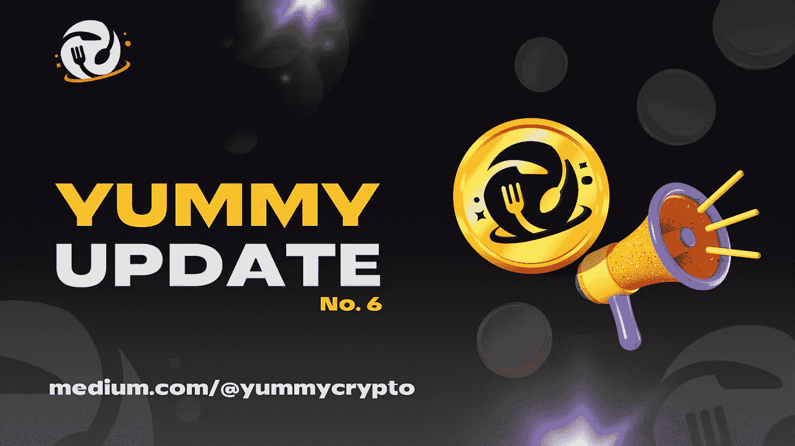
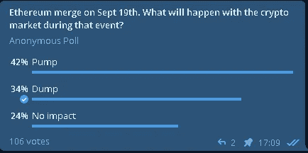
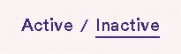
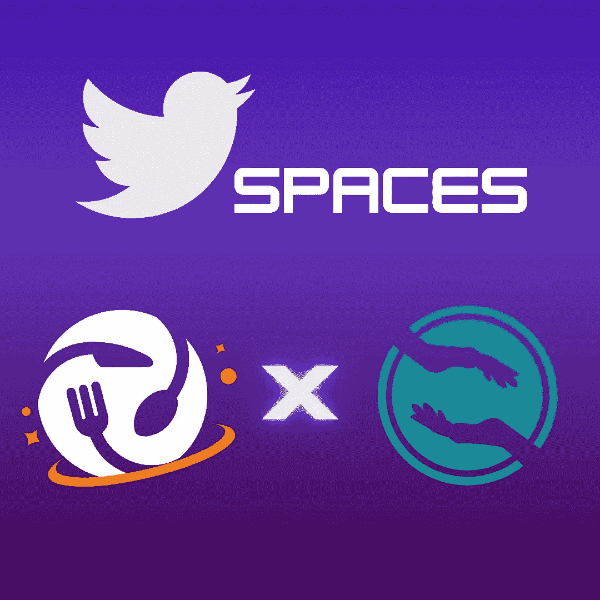
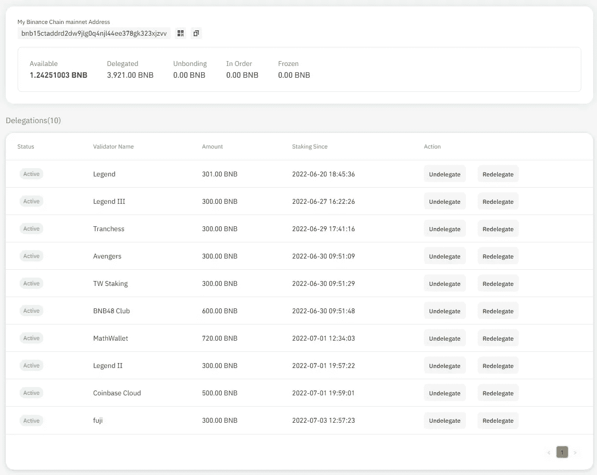

# 美味更新— 06

> 原文：<https://medium.com/coinmonks/yummy-update-06-6ae23a552ceb?source=collection_archive---------11----------------------->

亲爱的社区:

我们很高兴再次见到大家！让我们在这次更新中带给你最新的美味！

此版本:

*   新闻更新
*   赌注 Yummy，赚取上升池公告
*   美味&保存 Twitter 空间
*   Yummy-FOXV2 池公告
*   投资 FOXV2，赢得 FOXV2 池公告
*   股价上涨，赢得美味泳池公告
*   赌注 Yummy，赚取矿石池公告
*   美味的统计
*   YUSD 统计
*   打桩平台统计
*   增长基金统计
*   第八届篝火晚会结果

🔸新闻更新🔸

自上次更新以来有趣的市场动向。以太坊在 9 月 19 日与 PoS consensus 的合并引起了很多关注和新闻报道。在撰写本文时，以太坊的价格在大约一周的时间内上涨了 40%以上。比特币和流行的另类硬币市场看起来也不错。从“Twitter”等社交平台和“CoinTelegraph”等新闻网站来看，现在判断抛物线熊市趋势是否真的结束了，或者我们又一次被无情地套住了，还为时过早。

当谈到市场预测时，甚至我们自己的社区也存在很大的分歧。这项民意调查反映了一些思想情绪。

最后一组 AMA 在电报，乔富特谈到推出期待已久的'角斗士池。“我们对此感到非常兴奋！请继续关注更多关于“角斗士池”的信息。每周 AMA 的录音都上传到我们的电报室。

无论发生什么，Yummy 团队将继续前进，有了超过 4000 BNB 的增长基金，我们将乘风破浪，无论是高还是低👍🏼👍🏼

🔸赌注 Yummy，赚取上升池公告🔸

“赌注 Yummy，收入上升”池已经结束。确保从里面取出你的美味的代币。

您可以在合作伙伴页面的“非活动”部分找到该池。

🔸美味&保存 Twitter 空间🔸

接下来的每周 AMA 队(7 月-15 日)没有在 Yummy 主聊天中举行。相反，我们在 SAVE 的 Twitter 页面上建立了一个 Twitter 空间 AMA！

[https://twitter.com/stwtoken](https://twitter.com/stwtoken)

AMA 的录音可以在 SAVE 的推特页面上找到👍🏻👍🏻

🔸Yummy-FOXV2 池公告🔸

以下两个池已经结束:

赌注 Yummy，赚 FOXV2
赌注 FOXV2，赚 Yummy

确保从池中取出您的代币。如果您在“partners”部分看不到池，请单击“inactive”选项卡👍🏻

🔸投资 FOXV2，赢得 FOXV2 池公告🔸

现在就在我们的平台上直播！

下注 FOXV2，赢取 FOXV2🔥

该池开始有 90 天的长度。

🔸股价上涨，赢得美味泳池公告🔸

“增加赌注，赚取美味”的赌注已经结束。请从池子里取出你的代币。如果您在当前页面上看不到它，请检查“非活动”选项卡👍🏻👍🏻

🔸赌注 Yummy，赚取矿石池公告🔸

“赌注美味，赚取矿石”池已经结束。请从池子里取出你的代币。如果您在当前页面上看不到它，请检查“非活动”选项卡👍🏻👍🏻

🔸美味的统计🔸

价格:0.000003414 美元

总供应量:4.059 亿

循环供应量:367206260326

市值:1253642 美元

燃烧总量:594，098，090，230

🔸YUSD 统计🔸

价格:0.70 美元

总供应量:75 万

流通供应量:444646

市值:31.1252 万美元

🔸打桩平台统计🔸

**赌注:**
美味-美味总赌注:153，220，453，556 美味

YUSD-Yummy 总赌注:396065**YUSD**

****金库:**
Yummy-Yummy 90 天总赌注(未激活):10，612，043，140 Yummy**

****合作伙伴:****

**保存-保存总赌注:15750645092071**保存****

****保存-美味总赌注:9549984190936**保存******

******FOXV2-FOXV2 总赌注:21,757,230 FOXV2******

******矿石总赌注(无效):17，735，958，238******

******Yummy-上升总赌注(未激活):8，159，339，968 Yummy******

****崛起-Yummy 总赌注(未激活):16，891，228 崛起****

****Yummy-FOXV2 总赌注(未激活):238，575，695 Yummy****

****FOXV2-Yummy 总赌注(未激活):1，893，919 FOXV2****

******下注总额:**
189，966，370，597 Yummy → $648，545****

****396，065 美元→277，245 美元****

****16，891，228 上涨→＄11，823****

****23，651，149 fox v2→＄41，862****

****节省 25300630093007 美元→6451 美元****

****TVL:985926 美元****

****🔸增长基金统计🔸****

****3，921 BNB 在验证机赌注中→＄1，165，684****

********

****增长基金 DeFi 钱包(908)31，594 美元****

****净资产:1197278 美元****

****回购总额:**【443，444 美元】******

******🔸第八届篝火晚会结果🔸******

******篝火画现在完成了🔥🔥******

******获胜者是******

******0xf 45027 e 34 a5 CDA 79 C4 B4 f 759 b 749 ce 7975789 a 00******

******祝贺获胜者🎩******

******奖池:
129820913 Yummy******

******更新到此结束。一些有趣的时代似乎即将到来。让我们作为一个社区一起欢迎它！对许多人来说，现在是夏天，我们希望每个人在假期都过得愉快👍🏼******

******美味团队会一直努力工作，即使是在夏天😉******

******下次再见，请继续关注更多内容👍🏼👍🏼******

******最好的，******

******美味团队******

> ******交易新手？尝试[加密交易机器人](/coinmonks/crypto-trading-bot-c2ffce8acb2a)或[复制交易](/coinmonks/top-10-crypto-copy-trading-platforms-for-beginners-d0c37c7d698c)******