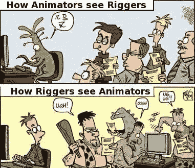

# 零创作者版税和永无止境的虚伪

> 原文：<https://medium.com/coinmonks/zero-creator-royalties-and-the-never-ending-hypocrisy-6ec01e7e1f7f?source=collection_archive---------38----------------------->

作者:杰夫·特里维斯

在加密领域有一场大辩论。我开始相信它实际上和时间一样古老，而且它实际上根本不是一场辩论。我将尝试解释一位艺术家对这种大惊小怪的观点和结论，我更愿意称之为“对创作者的持续攻击”。

早在 1993 年，当我开始在中学学习计算机课程时，有两个职业对我这个青春期的自己来说看起来非常有前途:一个是计算机编程，另一个是数字艺术。没有办法知道哪个部门会在未来变得更大，为什么。我想成为一名伟大的艺术家，并完全相信这一新工具将打开我艺术生涯的伟大和繁荣之门。

试用了一段时间 Deluxe Paint，当时的一个类似 Photoshop 的绘画软件，在报纸上看到教育部的号召:学生电脑艺术竞赛。主题是“太空旅行”。我尽了全力，画了点东西，邮到首都，得了一等奖:一台麦金塔电脑。哇！好像我已经成功了，也许我是个神童什么的？

我没有，这才是重点。我认为我不必成为天生的艺术大师，只要通过努力工作变得“非常好”就足以过上体面的生活…

一晃 30 年过去了，现在我见证了互联网、社交媒体、内容饕餮和注意力经济的崛起。在我职业生涯的最初几年，我信奉一个座右铭:做你喜欢的事，你一生中一天也不用工作！听起来真甜蜜。我太有才了。我也可以成为那些享受工作乐趣并以此谋生的杰出人士之一。我几乎同情那些带着领带和白天工作的失败者，浪费他们的生命每天通勤。这句格言如此有力，如此吸引人，以至于它无处不在。好像…这是一个广告活动或什么的…很奇怪。

我花了几年时间才意识到这句格言对我不利。如果我在工作中有如此多的乐趣，我甚至可能免费工作！这就是我开始在雇主的眼中和心中看到的。不言而喻的真相，房间里的大象，一个“mokita”。他们知道并利用了我们热爱自己工作的事实。我们甚至会比预期的做得更多，更快！工作时间更长，在周末，在假期…当我们要求加薪，甚至是欠我们的时候，我们会感到羞愧，或者无视最好的情况。

过了一会儿，我破解了密码:与许多其他职业不同，艺术是相对的……大众可能喜欢一件事胜过另一件事，不管他们的艺术品质或技术专长如何。人们的品味是不可否认的。除此之外，艺术是以趋势为基础的，趋势可以被分销渠道所操纵。相反，技术是完全相反的。它不像艺术那样相对，它要么有效，要么无效。技术专长是一个决定性因素，用户体验是有争议的。

## 制造有用的东西>制造美丽的东西。

因此出现了“饥饿的艺术家”这种陈词滥调。你不会听到“饥饿的医生”或“饥饿的工程师”这样的话。并不是所有人都这样，只是这不是我们社会的传统。对于艺术家来说，这一定已经持续了几个世纪。我们热爱我们所做的事情，我们所做的事情是相对的，所以我们注定要永远磨下去。当我试图成为一名艺术家时，我遇到的每个人都告诉我要为充满痛苦的生活做好准备。这是一个深深铭刻在我们社会中的观念，很久以前它肯定已经成为一种规范。

2021 年，在社交媒体上分享了我的数字插图并向其他工作室展示了我的技能二十年后，我听说了 NFT 及其永久的版税功能。它当场就让我震惊了。就是这样…互联网的第一个十年是一个过渡期，现在是艺术家们重新获得他们在右键点击+保存的年代中失去的一些欣赏的时候了。

一年后，几乎每一个第二好的二级市场都在试图取消艺术家的版税，同时尽可能保持他们的份额不变。毫无疑问:这不是这些平台之间的竞争，而是发行商对创作者的集体攻击。这种二元性没有被过多讨论，但它是许多问题的核心:分配控制生产。如果你不相信我，有一部纪录片讲述了迪士尼如何利用他们在电影发行方面的全球优势，迫使皮克斯，这个地球上最大的动画工作室屈服。最初，皮克斯电影只在海报上显示皮克斯的名字。现在你看到的是迪斯尼-皮克斯在每一次发行中的表现。迪士尼在后来的几年里花费了大量的时间和精力来吞并皮克斯，就像它在 3D 动画诞生之初否认其重要性一样。为《玩具总动员》的制作向约翰·拉塞特致敬。

我的观点是:在 2021 年的峰值(400 亿美元)期间，NFT 市场看起来异常诱人，许多企业家决定推翻 OpenSea，或者至少分一杯羹。由于 NFT 空间和加密市场的发展速度是现实生活的 10 倍，当这些竞争对手最终推出他们的平台时，我们已经处于熊市，在空间领域名声不佳。

他们试图向我们空投神奇的互联网货币，承诺庞兹赌注机制，回扣等等，但最终，管道是干的。OpenSea 一直占据主导地位，不断更新，而其他人的技术“有争议”不够先进。

现在他们来要我们的版税了。这是他们最后的手段，一直都是。这不是一场公开的辩论，而是一种含蓄的努力，通过将讨论保持在分销商制定的特定框架内，在行业内达成“制造许可”。这不是一个技术性的讨论，智能合约层面的争论只是其中无关紧要的一部分。这不是一个自由市场

讨论或者，在一个由少数人控制的市场中，多数人不可能自由。通过在 Twitter 上发布催人泪下的帖子和运行长达 4 小时的道歉空间，分销商正试图将讨论的目标从他们自己转移到收藏家和创作者身上。如果我们开始互相争斗，他们可以偷偷溜走，在外面看着。

我们都生活在一个以阶级为基础的社会里。一个行业的大玩家彼此相爱，胜过爱他们的供应商/消费者群体。因为它们证明了彼此的存在。他们是兄弟姐妹。另一方面，我们来自另一个家庭。

2021 年，NFT 市场的销售额达到 400 亿美元。你还记得在那段时间看到过任何收藏家抱怨他们支付的版税吗？或者，他们/我们是不是为了毫不犹豫地为大肆宣传的薄荷糖支付数千美元的油费而争先恐后？炫富是这个领域的标配。我们应该相信同样的人是创造者版税的受害者吗？我不记得有人抵制以太坊区块链或矿工，因为他们被迫为一份虚构的地契支付 5000 美元的交易费。相反，很多人因为那天钱包里只装了 1K 美元的汽油而被嘲笑。

这些催人泪下的故事和童话都不会消失，除非发行商剥夺创作者从 Web3 获得的所有额外收入，并将这个市场变成一个新-新-自由主义经济。他们想独享一切，只给我们留下足够生存的空间，这样我们就可以继续创造。

> 艺术家:不要听信这些废话。又来了。

版税是我们大多数人来到这个空间的主要原因。这就是为什么艺术家必须学会在创作艺术的同时创造“实用性”。这是一种有待挖掘的潜力，它可能会将艺术带到一个新的高度。版税是早期平台向我们承诺和宣传的东西。您仍然可以在 SuperRare 的主页上阅读该副本:

“先锋艺术市场版税
艺术家从其作品的所有二手销售中获得持续的版税——永远如此”

在这之间发生了什么，我们现在被告知版税不能在智能合同级别执行？为什么我们突然为自己贪婪的版税和懒惰感到羞耻？为什么我们总是被期望从虚无中创造，一次又一次，没有一个下降的缓冲，或者偶尔喘口气的奢侈？

听着，伙计们，我们过去曾经“拥有”的一切现在都变成了订阅模式，退出这些服务的障碍等于经历地狱。我不会因为问我宣传的是什么而感到羞愧。

如果你在抱怨版税，你不是收藏家。你要么是个赌徒，要么是个交易者，要么是个销售机器人，要么是个矛盾体。收藏家收集，他们不卖。艺术家不应该参与这场与赌徒和商人的斗争。我不相信版税对收藏家来说是个大问题。这是想加入开放海洋的人的问题，他们精打细算，想在熊市中找人咬一口。

那么，他们应该让他们的产品更好，然后创新，而不是试图单方面“凌驾”艺术家的生计。无视创造者价格标签的市场不是自由市场。自由已经存在于收藏家的决定权中，存在于艺术家的价格选择中，存在于平台的多样性中。如果 OpenSea 和其他大玩家加入这一趋势，那将是我们棺材上的最后一颗钉子。

那我们能做什么？

我认为我们可以从接受艺术这个事实开始，尽管它可能是相对的，但它不是宗教，也不是对社会的恩惠。这首先是一份工作，是我们谋生的手段。还记得“做你喜欢的事”这句格言吗？在我第一次听到这句话的 20 年后，我的一位非常成功的商人朋友告诉了我另一句格言，真理是:“如果工作是一件令人愉快的事情，没有人会付钱让你去做那件事…

工作很辛苦。很不愉快。它奴役我们，消耗我们的生命。为此得到补偿才公平。不要看一些已经成名的艺术家鼓吹你要更加努力，不要抱怨，要建立一个名字，要有耐心。不是说他们说的没有价值，有价值。只是他们的态度是骗人的。我们大多数人不会在一个破碎的系统中成功

这奖励了顶尖的百分之几，却免费消耗了整体的创造。这就是互联网，它就是它…

如果我们不喜欢这个方向，我们必须建立更好的发行平台，赋予艺术家权力。我们必须在金融知识和技术知识方面做得更好。我们必须把左脑和右脑分开，学会如何在邪恶的资本主义市场中成为一名商人。

我们被教导如何做出伟大的东西，但我们从未被教导真实世界的经济是如何运作的，或者如何销售我们的产品。这就是为什么我们毕业后不久就会受到精神创伤。我们感到缺少课堂上那种有益的、创造性的经历。我们一直被情感编程和灌输不断创造，但我们被剥夺了将这些创造转化为成功业务的工具。那个位置已经被另一个组占用了，我们不需要担心，只要继续创建就行了。

成为一名优秀的艺术家是世界上最难的工作之一。尽管相对而言，艺术背后有不断发展的科学。大多数艺术家生活在恶劣的条件下，只有少数人真正做到了。艺术界也不是野餐，当你变得优秀时，没有人张开双臂等着你。这是一个裙带资本主义结构，一个成员俱乐部，我们不在其中。我们要么必须做一些他们不能单独忽视的事情，要么我们需要努力建立一个更好的结构，共同奖励坚持不懈、创造性和真实性。

你总是可以选择从数百万人中“成功”出来。如果或者当那一天到来的时候，你甚至可以说教别人。或者，你可以选择更认真地对待你一生的工作，开始看数据。赔率对艺术家不利。

我们必须超越我们的右脑，抓住一些分配权力。因为没有人会把它给我们…

— — — — — — — — — — — — — — — — — — — — — -

我是资深动画导演、插画师，也是胎记纹身的创始人。我有时会根据我个人的伪科学观察写一些分析性的想法。在胎记，我们正在建立一个策划平台，将改变纹身行业，并赋予艺术家。为支持我的工作，请关注我的账户:

[https://twitter.com/BirthMarkAPP](https://twitter.com/BirthMarkAPP)https://twitter.com/TrevesStudiosT2

> 交易新手？试试[密码交易机器人](/coinmonks/crypto-trading-bot-c2ffce8acb2a)或[复制交易](/coinmonks/top-10-crypto-copy-trading-platforms-for-beginners-d0c37c7d698c)