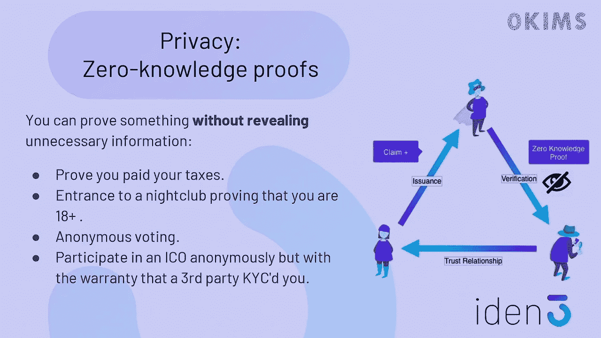

# 区块链中的零知识证明:实现与误用

> 原文：<https://medium.com/coinmonks/zero-knowledge-proofs-in-blockchain-its-implementation-and-misuse-12a8a7a1e04c?source=collection_archive---------22----------------------->

Image Reference : [https://www.youtube.com/watch?v=OcmvMs4AMbM](https://www.youtube.com/watch?v=OcmvMs4AMbM)

零知识证明(ZKPs)是在区块链上实现私有安全交易的有力工具。使用零知识证明，一方(证明者)可以向另一方(验证者)证明他们知道一条信息，而不用透露这条信息是什么。例如，这可用于证明资产所有权或认证交易，而不会泄露任何敏感细节。

> 不知道什么时候买卖 cryp，试试[复制交易](http://coincodecap.com/go/bityard)。

Image Reference : [https://www.youtube.com/watch?v=Rd6SMShk7-c](https://www.youtube.com/watch?v=Rd6SMShk7-c)

在本文中，我们将解释如何在区块链上实现零知识证明。

## 步骤 1:定义要证明的陈述

实现零知识证明的第一步是定义要证明的语句。这可能类似于“我知道进入某个账户的密码”，或者“我是某项资产的所有者。”

仔细考虑要证明的语句很重要，因为它将决定证明协议的结构和复杂性。

## 步骤 2:创建证明协议

一旦定义了要证明的语句，下一步就是创建一组规则或协议，证明者和验证者可以遵循这些规则或协议来执行证明。这通常涉及证明者和验证者交换消息和执行某些计算。

有许多不同类型的零知识证明，每一种都有自己特定的一套规则。一些常见的零知识证明类型包括:

*   交互式证明:在交互式证明中，证明者和验证者来回交换消息，直到证明完成。
*   非交互式证明:在非交互式证明中，证明者创建一条消息，其中包含验证者检查证明所需的所有信息。
*   简洁证明:简洁证明是零知识证明，在需要交换的信息量方面非常高效。

## 步骤 3:用代码实现证明

一旦创建了证明协议，下一步就是用代码实现它。这通常包括编写一个可以在区块链上执行的程序或智能合同。

所需的具体代码将取决于您正在实现的零知识证明的类型以及您正在使用的区块链平台。实现零知识证明的一些常见编程语言和框架包括:

*   zk-SNARKs: zk-SNARKs(零知识简洁的非交互式知识论证)是实现零知识证明的流行框架。它们基于先进的加密技术，设计得非常高效且可扩展。
*   bullet proof:bullet proof 是一种非交互式零知识证明，特别适合在区块链上使用。它们是高效的，并且可以用多种编程语言实现。
*   STARKs: STARKs(可扩展的透明知识论证)是一种零知识证明，它被设计得非常高效和易于实现。它们可用于在区块链上创建透明、可验证的计算。

## 第四步:测试证据

在区块链上部署 proof 之前，必须对其进行彻底测试，以确保其正常工作。这将涉及让证明者和验证者执行证明，并验证是否获得了正确的结果。

对证明执行安全审计也是一个好主意，以确保它能够抵御攻击和漏洞。

## 步骤 5:在区块链上部署证据

测试证明并确保其正常工作后，最后一步是将证明代码发布到区块链上，供其他用户使用。

它们也有一些应该考虑的缺点。其中包括:

1.  **复杂性:**实现零知识证明可能是一个复杂的过程，需要彻底理解密码学和区块链技术。这可能会给不熟悉这些概念的开发人员造成困难。
2.  **资源需求:**零知识证明在计算和存储方面都是资源密集型的。这使得它们不适合在某些场景或某些类型的区块链平台上使用。
3.  **性能:**零知识证明比传统的加密技术要慢，因为它们涉及更复杂的计算和消息交换。这使得它们不太适合用于高通量应用。
4.  **有限的兼容性:**零知识证明并不被所有的区块链平台支持，可能需要使用专门的工具或框架。这可能会限制它们在某些情况下的采用和使用。
5.  **误用可能性:**虽然零知识证明旨在保护隐私，但它们也可能被用于邪恶的目的，例如支持在区块链上进行非法或不道德的活动。这可能是监管机构和执法机构的一个担忧。

> 加入 Coinmonks [电报频道](https://t.me/coincodecap)和 [Youtube 频道](https://www.youtube.com/c/coinmonks/videos)了解加密交易和投资

# 另外，阅读

*   [CoinLoan 审查](https://coincodecap.com/coinloan-review) | [YouHodler 审查](/coinmonks/youhodler-4-easy-ways-to-make-money-98969b9689f2) | [BlockFi 审查](https://coincodecap.com/blockfi-review)
*   XT.COM 评论 | [币安评论](https://coincodecap.com/xt-com-review)
*   [SmithBot 评论](https://coincodecap.com/smithbot-review) | [4 款最佳免费开源交易机器人](https://coincodecap.com/free-open-source-trading-bots)
*   [比特币基地僵尸程序](/coinmonks/coinbase-bots-ac6359e897f3) | [AscendEX 审查](/coinmonks/ascendex-review-53e829cf75fa) | [OKEx 交易僵尸程序](/coinmonks/okex-trading-bots-234920f61e60)
*   [如何在印度购买比特币？](/coinmonks/buy-bitcoin-in-india-feb50ddfef94) | [瓦济克斯审查](/coinmonks/wazirx-review-5c811b074f5b)