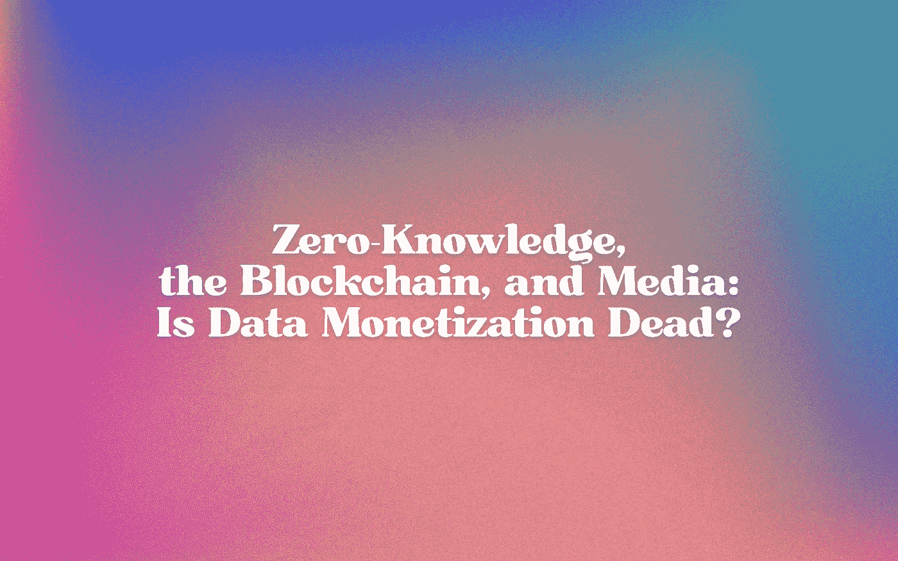

# 零知识、区块链和媒体:数据货币化已死吗？

> 原文：<https://medium.com/coinmonks/zero-knowledge-the-blockchain-and-media-is-data-monetization-dead-e7645e54b8e2?source=collection_archive---------60----------------------->

> 前言:这篇论文最初是作为我的 MS 项目的一部分，作为大数据课程的期末论文而写的。因此，它主要是以学术的口吻编写的，可能有点晦涩，因为没有使用许多 web3 原生的术语。假设本文的读者不是精通 web3 的专业人士，而是对 web3 好奇的信徒。
> 
> 感谢您的阅读，并随时与[联系讨论更多](https://twitter.com/eshpvt) ( &也许会启发我的 MS 顶点论文)！

# 介绍

可以理解的是，加密货币和 web3 在一个比以前更大的社会意识中的出现，导致了对一个**完全去中心化的数字社会**可能以何种方式表现的调查和实验。像不可替代令牌这样的新技术已经开始更全面地融入媒体领域，主流采用已经在进行中。有鉴于此，人们也在重新思考去中心化的媒体平台是什么样子:它们是社交媒体平台的替代品，还是视频或音频的媒体托管平台。

> 不知道什么时候买卖 cryp，试试[复制交易](http://coincodecap.com/go/bityard)。

我们目前的媒体平台——网飞、Instagram、Spotify 等——的一个更基本的方面是，它们是大数据的集中存储。数百万用户自愿将足够的数据委托给这些媒体公司，这些公司反过来能够使用这些数据对他们的用户进行假设和描述，以改善他们的服务，或者通过数据货币化将他们的数据出售给第三方。我们的足够多的数据，无论是个人身份信息还是行为趋势，都被分发给其他公司，这些公司利用这些数据生产更多的媒体，以继续消费和影响公众舆论。

分权的基本信条之一是**增加** [**隐私**](https://esha.mirror.xyz/mQ_vWiK8H11iCzZK9ux2vqvvGShYqexuS3PDGqaBtzE) 。在金融环境中，当人们想到“加密”时，更经常想到的是，它相当于不把个人的钱托付给“大银行”，而是拥有自己资产的托管权，能够“私下”与他人进行交易，而无需第三方中介。对于媒体平台来说，消除一个中间的第三方将是棘手的，因为这可能意味着消除平台本身。

> 那么，媒体行业如何适应这种局面呢？

在这篇文章中，我将探索一种可能的途径，让 web3 媒体公司培育一种分散的媒体格局，同时尽管有匿名化和增强的隐私，仍能处理数据。我将首先以基本的方式介绍零知识证明的概念，以说明如何创建一个保护用户隐私的平台。然后，我将探索哪些数据是媒体平台可以获得的，尽管自我保管数据隐私。最后，我将探讨媒体平台如何利用这些数据来继续基于数据的做法，在保持用户隐私的同时，继续数据驱动的决策和货币化的遗产。

# 零知识证明和隐私

**零知识证明** (ZKPs)是一种在不需要知道数据本身价值的情况下，确认一个人对某个数据 X 的知识的真实性的密码学方式。假设有两方:验证者 V 和示证者 P. P 声称知道一些数据 X，这些数据将授权他们访问某个设施。v 需要验证 P 确实知道数据，而不知道 X 的值是多少，因为 P 拒绝透露。

为此，V 和 P 都必须参与一个**证明**系统。当(1) V 确信 P 确实知道访问所必需的数据，以及(2)如果 P 不知道所必需的数据，V 应该能够确保 P 不能伪造这一知识-证明必须是完整的和可靠的(或有效的)。

这个证明被认为是“零知识”的最后一个标准是，如果 V 确信 P 确实有必要的知识，V 也不能伪造他们自己的数据知识。

整个证明过程是一个数学过程，最简单的描述是，如果 P 需要知道答案，例如，进入一个房间的数独难题，P 能够向 V 证明这一知识而不透露答案本身，V 必须对 P 的证明有信心[相信他们有这一知识](http://euler.nmt.edu/~brian/students/pope.pdf)。

zkp 的扩展是 [zK-SNARKs](https://fisher.wharton.upenn.edu/wp-content/uploads/2020/09/Thesis_Terrence-Jo.pdf) ，它具有**附加的**先决条件，即“简洁”和“非交互”。这实质上意味着证明可以使用更少的数据快速完成，并且只需要证明者和验证者之间的一次交互，而不是来回的对话。

ZKP 的目标是在两方之间建立一个完整的**私人交互**，其中只有一方知道某些数据，并且不需要为了获得对服务或其他信息的访问而暴露该数据。在行政管理环境中，这相当于不需要披露个人的社会安全号码来证明信用价值以开立新的信用额度，或者不需要披露他们的护照细节来证明他们的公民身份或身份。在较小的规模上，这相当于不需要输入用户名和密码来向平台证明他们拥有帐户或有权访问某些数据或内容。从安全角度来看，这是**更安全的**，因为没有通过网络传输密码，因此没有加密缺陷或数据泄漏。

**选择性披露**，这也是 ZKPs 所允许的，允许用户获得他们数据的所有权，并就这些数据对平台和服务的可用性做出**主动**决定。这不是强制隐私，而是选择性隐私:消费者有机会选择他们想要提供的数据，以及他们想要保留的隐私，但仍然可以继续使用相同的功能和服务。由于去中心化与隐私息息相关，这可能是下一代基于数据的应用和平台的下一条路线。

鉴于这种日益增加的隐私，媒体平台和公司还有哪些数据需要收集和分析？

# 区块链分析和我们剩下的东西

假设存在一个 web3 媒体平台，其主要功能是托管视频流。用户通过签署一份确认其订阅并允许他们访问该平台的区块链合同来登录该平台，该平台可通过每月或每年的订阅获得。该平台只有他们的钱包地址，用于签署进入合同，并可以通过 ZKP 支付确认协议验证他们的订阅。

在这种情况下，媒体公司**没有**目前媒体公司能够收集的任何数据:没有人口统计信息，没有电子邮件地址或密码，也没有个人身份信息。他们拥有的唯一关于单个用户的数据是他们的钱包地址([“钱包”在这里有点用词不当](https://gaby.mirror.xyz/0Wq9zk0pZu_s3W1S4BiNcYXw9uSfSVbyGjNPgLHcs18))。

虽然乍一看，钱包地址在收集主人信息方面似乎有点用处，但它们在建立一个人的*链上身份和网络*方面非常有用。这是因为钱包地址是区块链上的**标识符**:密码交互的公共分类账。因此，他们公开的数据与钱包活动有关:这个钱包中包含多少资产，这个钱包与其他哪些钱包进行交易，这个钱包与哪些服务频繁交互？这些问题的答案有助于建立一个单一地址的**整体概况**，并且符合一些人所说的区块链分析。

在某些情况下，还可以将身份与地址相关联。这可以通过两种不同的方式实现:要么是灵魂绑定的 NFTs，要么是可验证的凭证。一个灵魂绑定的 NFT 被永久地绑定在一个地址上，不能被转移或销毁，从而作为地址所有权的一个标识。另一方面，可验证的凭证是包含关于已经由可信来源验证的地址的信息的数字资产(因此可以被认为是可信的)。具有任何这些资产的地址可以与身份相关联。

*本文的范围仅限于没有此类标识符的钱包，因为这些标识资产使得数据收集与 web2 媒体平台的数据收集非常相似。*

那么，这给已经将大数据作为其收入和内容生成渠道不可或缺的一部分的媒体平台和公司带来了什么？很简单，web3 媒体平台和公司必须将其研发的很大一部分集中在**区块链分析**上，以便以一种**尊重 ZKP** 提供的隐私的方式获得对其消费者基础的洞察，同时保持对 web2 数据模型的**回应。**

# 新的“大数据”和媒体

考虑到媒体公司现在必须处理的数据是基于区块链的公开数据，这些数据仅限于公开签署的交易和互动，我们必须重新思考我们可以从中获得的**洞察力**。虽然人口统计和其他身份第一的数据指标现在很少，但有更多的途径可以探索**行为数据**和区块链**持久性的意义**；也就是说，让一个人的资产和互动永垂不朽以供分析。

通过与交易历史(资产所有权)、关联地址(网络和普遍互动的合同和服务)和身份(如果可用)相关的数据，媒体平台的区块链分析可以产生影响订阅分析、计费模式和市场研究的见解。

**订阅分析**对于一个 web3-first 平台来说，更多的是关于网络和资产，而不是基于人口统计的订阅(居住国家、年龄、性别等)。假设大多数地址没有与其相关联的身份相关资产，对其链上数据的初步分析将揭示他们与哪些合同(服务)交互最活跃(即，以足以记录在链上的永久方式进行交易或访问)。这将使平台能够完全基于用户的贡献和链上活动来创建用户的档案，这是主动的而不是被动的。

**计费模式**也会受到该数据分析的影响；了解平台用户的平均净资产价值可以为计费策略和价格提供信息。在一个自我延续的周期中，这将反映出决定订阅费率的更有影响力的市场力量，而不是市场内部的勾结。

最后，能够了解平台用户群的行为模式可以更好地通知**媒体节目**。在战略层面上，这种信息比我们目前通过尼尔森处理的被动流数据或通过现有平台的自我报告流活动更活跃，因为某些确定的行动在区块链上是永久的，除非被主动绕过。NFT 资产的所有权、与其他钱包或合同的交互以及任何链上的公共信息都可以帮助平台根据实时反馈回路更好地评估他们的下一步战略举措。

当然，基于身份的信息与地址的关联仍然可以为媒体平台提供它们当前使用的相同数据。即使在订阅和付费的 ZKP 框架内，也有允许[选择性去匿名化](https://a16zcrypto.com/privacy-protecting-regulatory-solutions-using-zero-knowledge-proofs-full-paper/)的规定:例如，自愿的选择性去匿名化始终可用于媒体消费者，这些消费者愿意向平台透露他们的身份，以换取个性化的服务，而不是那些宁愿在平台上保持匿名的人。

这也可以作为欺诈或可疑不当行为的预防措施:为了证明清白或合法所有权，用户可以选择自愿和选择性地取消匿名来证明自己。他们将不再受隐私保护协议的保护，因为他们的其他身份信息将与其钱包地址(如电子邮件地址和密码，或任何基于多因素身份认证的信息)关联(不一定是链上的)。像分散标识符这样的技术可以被整合到平台中用于这些目的，并且可以保持模糊直到自愿披露。

总的来说，媒体公司转向适应分散化环境的优势远远超过其在数据驱动的决策过程中可能遇到的限制。ZKP 第一，用户信息的私人方法增加了用户群的信任和透明度，用户群有针对性地寻找不拦截个人身份信息的平台。这不仅为订阅的金融交易，而且为与平台和任何附属合同的互动创造了一个整体上更加安全的**环境**，潜在地也**减少了权力的集中滥用**。最后，ZKP 登录可以与其他 web3 分散应用集成，为寻求跨功能和合作环境的用户创造更加无缝的体验。

# 进一步研究

虽然本文为隐私优先的媒体方法建立了一个初步的工作框架，以便媒体公司转向并适应分散的 web3 环境，但在建立此类平台的协议、程序和标准方面还有很长的路要走。需要进一步的研究和实验，通过可验证的证书和分散的标识符，将基于零知识证明的登录结构与自愿去匿名化完全集成。此外，还需要详细描述链上和链下数据，以及作为其中一部分(或不作为其中一部分)的确切内容。最后，需要对 ZKP 如何适应媒体公司的数据实践和用户互动进行更严格的审查。

> 加入 Coinmonks [电报频道](https://t.me/coincodecap)和 [Youtube 频道](https://www.youtube.com/c/coinmonks/videos)了解加密交易和投资

# 另外，阅读

*   [八大加密附属计划](https://coincodecap.com/crypto-affiliate-programs) | [eToro vs 比特币基地](https://coincodecap.com/etoro-vs-coinbase)
*   [最佳以太坊钱包](https://coincodecap.com/best-ethereum-wallets) | [电报上的加密货币机器人](https://coincodecap.com/telegram-crypto-bots)
*   [交易杠杆代币的最佳交易所](https://coincodecap.com/leveraged-token-exchanges) | [购买 Floki](https://coincodecap.com/buy-floki-inu-token)
*   [3 commas vs . Pionex vs . crypto hopper](https://coincodecap.com/3commas-vs-pionex-vs-cryptohopper)|[Bingbon Review](https://coincodecap.com/bingbon-review)