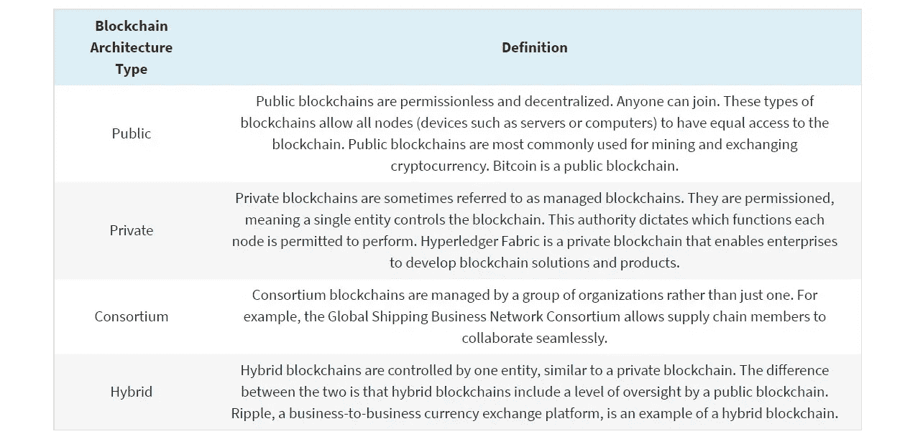

# 从零到英雄

> 原文：<https://medium.com/coinmonks/zero-to-hero-9942d8b9c3da?source=collection_archive---------25----------------------->

## 成为 CSC 的区块链开发者

许多人误解了区块链。出于这个原因，进入或过渡到区块链发展似乎具有挑战性。但是区块链技术并不像它的名声所暗示的那样神秘。如题所示，在这个指南中，我将向你展示如何成为一名区块链开发者。您很快就会看到，区块链开发与常规的 web 开发没有太大的不同。为了让你轻松一些，我写了这个指南来帮助你学习区块链开发，并在每一节的最后给你行动步骤。

比特币区块链的发展范围有点有限。然而，以太坊的出现彻底改变了这项运动，它是世界上第一台可编程的区块链。全世界的开发者终于有机会在区块链上构建应用程序。这就是为什么学习区块链开发成为如此热门的技能。

不言而喻，我们生活在“区块链时代”。它对我们未来的影响确实是可怕和巨大的，但首先

**什么是区块链？—** 区块链是一种用于存储和组织信息的数据库。传统的数据库将信息排列成构成表格的行和列。这使得信息很容易被计算机识别。然而，使用区块链，信息被数字化格式化并被收集成簇或 T4 块。每个块都有有限的存储容量…

*   区块链的目标是允许数字信息被记录和分发，但不能被编辑。这样，区块链就是不可变分类账的基础，也就是不能被修改、删除或销毁的交易记录的基础。

…一旦达到该容量，该块将关闭并通过加密技术链接到前一个块，从而创建一个链。当一个块链接到另一个块时，加密技术会创建一个不可更改的时间戳。此永久记录验证交易等敏感信息的准确性。另一方面，传统数据库通常由中央机构控制。敏感数据可能由组织或管理员管理和维护。

**什么是 CSC？— CoinEx Smart Chain — CSC** 是一个分散的公共区块链，旨在解决旧链中出现的各种问题。它的效率很高，开发人员可以在上面轻松地进行创新。CSC 是低成本的，这意味着使用区块链和其上的平台是非常实惠的，用户在使用其功能之前不必在汽油费上花费太多。开发人员可以编写和运行智能合同，在网络上构建和部署 DApps，以及存储数字资产。

一个区块链开发者做什么？— 区块链开发人员是专注于区块链技术的软件开发人员。开发人员对软件和系统进行编程、开发和测试。有两种主要类型的区块链开发者:

1.核心区块链开发者。核心区块链开发人员开发和维护区块链系统的架构。他们设计协议，开发安全模式，并从整体上监管网络。

2.区块链软件开发者。区块链软件开发商在现有的区块链平台上构建应用程序(DApps)。他们处理前端和后端开发、设计和维护。

**成为区块链开发者有什么好处？—** 对区块链开发人员的需求很高，因为他们从事颠覆性和激动人心的技术工作。因此，这个领域的工作机会很多。美国劳工统计局(BLS)预测，2020 年至 2030 年间，软件开发工作将增长 22%。研究表明，到 2025 年，区块链市场将攀升至 390 亿美元以上。获得与快速发展的技术相关的技能有助于你成为更有竞争力的求职者。此外，许多区块链开发商的工资很高。Glassdoor 报告称，美国区块链开发者的平均年薪为 119，780 美元。

## 开始成为区块链开发者的旅程

首先，这需要时间，你需要将你的时间和资源投入到你的教育中，CSC 有专门的资源来帮助你轻松学习。其次，不要期望立竿见影的效果，成为区块链开发商并不是一个神奇的药丸。如果你是区块链行业的新手，你可能会从学习如何编码开始。许多区块链开发人员都是从计算机科学或信息技术学位开始他们的职业生涯的。一旦你掌握了软件开发和计算机编程的基础知识，你就可以专注于区块链。

***如果你是初学者，那么有一定的术语需要你熟悉:***

*   区块链:区块链是一个区块链，其中每个区块都包含有价值的数据，没有任何中央监管。它是加密安全和不可改变的。
*   去中心化:区块链之所以说是去中心化，是因为没有中央权威机构监管任何事情。
*   共识机制:分散网络在某些问题上达成共识的机制。
*   矿工:使用他们的计算能力挖掘区块的用户。

## 1.了解区块链的基本面

*像区块链技术这样的创新和革命性技术面临的最大障碍之一是熟悉系统中的各种概念。*

首先，你需要对区块链技术有一个基本的了解。建立基础知识将为你学习更高级的科目和专业做好准备。这就像你在尝试一道复杂的菜之前需要知道基本的烹饪原理一样。

## 2.学习基本技能

通过课程和实践建立你的技能组合。成为区块链开发者有许多不同的途径，所以不要着急，找到适合你的那一条。

*   编程。编码将是你的区块链开发专业知识的框架。
*   编程语言。通过学习一些区块链开发人员最常用的编程语言来扩展您的技能。Python 是区块链开发中最流行的语言之一，这是因为它的通用性。
*   密码学。密码术是区块链技术的组成部分。它通过确保消息的内容只能被预期的接收者看到来保护敏感信息。
*   智能合同。如上所述，智能合约是存储在区块链上的程序。通过自动化遵从，它使双方能够在没有中介的情况下执行协议。如果您想使用智能合同，您可能希望获得智能合同开发方面的认证。
*   数据结构。对于区块链开发人员来说，要成功地构建和实现网络，他们必须能够使用各种数据结构，比如 Merkle 树。了解更多关于通用数据结构以及如何用数据结构专门化来实现它们
*   区块链架构。了解每种类型的区块链建筑有助于确定职业重点领域。目前，有四种类型的区块链体系结构:公共、私有、联盟和混合。

## 为什么选择 CSC？

作为一名区块链开发者，你将在后台面临大量的挑战。创建和维护一个公共区块链并不容易。CSC 是优先的区块链，原因有很多，因为它消除了开发人员在创建或构建现有链时面临的大多数挑战。

*   安全——区块链应该是堡垒。首先，代码是公开的，所有人都可以看到。任何人都可以查看代码，检查错误和漏洞。然而，与其他开放代码资源不同，在区块链代码上寻找漏洞的负面影响是巨大的。由于这些合理的安全考虑，区块链的发展通常非常缓慢。CSC 是一个高度安全的区块链，因为它运行在顶级安全协议上，因为它的概念 CSC 从未经历过任何安全事故，因此开发人员总是成功地在这个链上构建和部署他们的项目。
*   资源管理—与网络保持同步非常重要。你不能落后太多，跟不上所有的网络需求。您应该准备好处理远程和本地查询。CoinEx 是一个在 CSC 网络上运行的全球货币交易所，作为一个 DeFi 工具，它需要顶级的资源管理，而 CSC 正好提供了这一点。
*   性能——区块链必须始终尽最大可能发挥其性能，但要做到这一点，所选择的语言必须非常通用。CSC 具有高性能，支持高达 600+ TPS 的极高性能事务。

## 3.熟悉 WEB3 和 CSC 生态系统

看到这么多初露头角的“开发者”根本没有任何真实世界的加密货币第一手经验，真是令人惊讶。当你一次都没用过一个平台的时候，你怎么可能对它进行创新和改进呢？强烈建议您今天就开始熟悉该系统。

去 [CSC](https://www.coinex.org/?lang=en_US) 熟悉一下生态系统。与生态系统中的各种 DApps 互动，并充分了解他们。

虽然区块链发展是一个专业，它包括几个重点领域。考虑从上面列出的相关技能中选择几个你感兴趣的话题。阅读关于该专业的博客或 YouTube 视频可以帮助你了解行业趋势和热门技能。你也可以在社交媒体上关注你感兴趣领域的行业领袖。

> 交易新手？试试[密码交易机器人](/coinmonks/crypto-trading-bot-c2ffce8acb2a)或者[复制交易](/coinmonks/top-10-crypto-copy-trading-platforms-for-beginners-d0c37c7d698c)