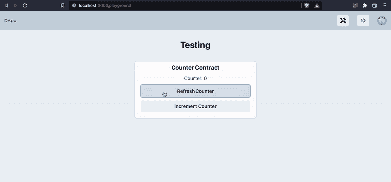

# 10 分钟内完成从零到英雄的全栈 DApp 开发

> 原文：<https://medium.com/coinmonks/zero-to-hero-full-stack-dapp-development-in-10-minutes-8e42d58b7d91?source=collection_archive---------3----------------------->


# 欢迎光临！

本指南旨在为您提供 2022 年开始开发全栈以太坊(EVM)分散式应用(dApps)所需的工具和现代技术的全面覆盖。无论是你的第一次，还是你想重温现代 DApp 堆栈，这个指南是给你的！

我们将使用以下新框架和技术启动 dApp 堆栈:

*   **React NextJS** —负责我们的前端开发和部署
*   **打字稿** —用于打字安全和清洁代码；)
*   **安全帽** —用于我们的智能合同开发、测试和部署
*   ChakraUI —作为我们的 UI 组件库(尽管你可以很容易地把它换成你喜欢的库！)

## 你需要知道的是

我们将尝试涵盖本指南中的所有内容，但是，有一些先验知识会让您的生活更轻松:

*   React 是大多数 dApp 前端的核心，你应该对 React 开发的基础有所了解。
*   **节点** —本指南要求熟悉并安装节点。我们正在使用`v16.15.x`，然而其他版本*应该*也可以。
*   **对 DApp 的基本了解**——熟悉 DApps 或之前使用过 DApps 将对你的理解有很大帮助。我们还将假设您已经安装了[元掩码](https://metamask.io/)，并且对它有一个基本的了解！

## 我们将涵盖的内容:

— 1.[我们在建设什么](#202d)
— 2。[设置我们的项目](#5df5)
— 3。[模板概述](#2a83)
— 4。[运行模板](#8ce0)
— 5。[实现我们自己的反 DApp](#e2b9)
— 6。[将其部署到全球](#5f5d)

# 1.我们正在建造的东西

我们将为一个简单的计数器应用程序构建智能合约、前端和区块链交互逻辑。尽管是一个简单的 dApp，你将学到的技能可以很容易地应用到使用相同技术的大型项目中。



为了做到这一点，我们将制定一个 dApp 模板，其中包含所有可供我们使用的核心技术。这个模板足够灵活，我们可以根据它构建任何我们想要的 dApp。

[](https://github.com/gmulhearn/dapp-stack-template) [## GitHub-gmulhearn/dapp-stack-template:hard hat next js React Chakra-UI 在 Typescript 模板中！

### 以下项目旨在使基于 EVM 的分散式 web 应用程序的引导变得像…

github.com](https://github.com/gmulhearn/dapp-stack-template) 

# 2.设置我们的项目

## 装置

让我们从首先拉下模板项目并在 VS 代码(或者您选择的 IDE)中打开它开始。

```
git clone [https://github.com/gmulhearn/dapp-stack-template.git](https://github.com/gmulhearn/dapp-stack-template.git) counter-dapp && cd counter-dapp
```

接下来，我们需要为 hardhat 项目和 NextJS/前端项目安装包依赖项:

```
cd hardhat && npm install && cd ..
cd nextjs && npm install && cd ..
```

现在安装我们的智能合同开发环境 hardhat:

```
npm install -g hardhat-shorthand 
```

## 配置

我们需要给 hardhat 一个基于以太坊的钱包，通过输入一个秘密的助记符种子短语到`hardhat`目录下的`.env`文件中来使用。首先，我们需要为开发生成一个种子短语。这可以使用已经安装在我们的 hardhat 项目中的 bip39 来完成:

```
node -e 'console.log(require("bip39").generateMnemonic())'
```

由此输出的 12-24 个单词是您的种子短语，将用于打开您的部署以太坊钱包。如果您在生产部署中使用这个种子短语，那么对这个短语保密是非常重要的！

使用这个短语，在项目的`hardhat`目录中创建一个`.env`文件(`touch .env`，并将其填写如下:

```
MNEMONIC="<insert your 12-24 word mnemonic seed phrase>"
```


Note — file structure in the left explorer may not be up-to-date.

完成所有设置后，让我们从里到外了解一下这个模板。

# 3.模板概述

项目根目录下的 [README.md](https://github.com/gmulhearn/dapp-stack-template/blob/main/README.md) 详细描述了该项目及其设置，不过，让我们一起来过一遍。

## 后端/安全帽开发环境

从项目的`hardhat`目录中，您会看到以下目录:

*   `contracts` —包含项目的所有智能合约的目录。目前，只有一个默认合同:`Greeter.sol`。
*   `scripts` —您的 hardhat 客户端将使用的脚本。目前，主脚本是`deploy.ts`，它包含 hardhat 将您的智能合约部署到您选择的网络的指令。
*   `test` —运行 hardhat 的集成测试，确保您的合同有效。
*   `hardhat.config.ts` —针对您的 hardhat 客户端的配置。在本指南中，我们不会过多地涉及这一点，但是，您可以使用它来添加新的部署链(我们将在后面涉及这一点)等等。

## 前端

在`nextjs`目录中是你所有的前端代码。在很大程度上，这是一个非常典型的 NextJS 项目结构，但是，为了便于开发，还需要一些特殊的部分。

很多前端依赖于根`artifacts`目录中的数据。该目录中将包含以下内容:

*   `hardhat` —由`deploy.ts`脚本自动填充的目录。该目录包含智能合同 ABI，我们的前端使用这些 ABI 来连接到我们的智能合同并与之交互。
*   `contractDeployments.json` —一个文件，包含关于项目合同的信息以及每个链的部署地址。目前，这个文件只有默认的`Greeter`合同部署信息。我们的 hardhat deploy 脚本将在每次部署后用更新的地址填充这个 JSON，这样我们就不必担心手动硬编码任何地址。
*   `typechain` —由 hardhat 在每次编译时创建的自动生成的目录，其中包含您的类型脚本代码可以使用的类和类型，以干净和类型化的方式轻松地与您部署的契约进行交互。

在 NextJS 项目本身中，这个模板的一个关键部分是`core/ethereum/ethereum.ts`中的`useDappStatus`钩子。这是一个钩子，当你在应用程序中添加更多的契约时，你可以使用和扩展它。该挂钩用于整个前端，以提供一种与智能合约和用户的以太坊钱包客户端(MetaMask 或 WalletConnect)进行交互的简单方法。

# 4.运行模板

在我们开始实现我们自己的计数器 dApp 之前，让我们部署并运行这个模板的默认“欢迎”dApp。

首先，让我们打开 3 个独立的终端。在您的第一个终端中，我们将建立 hardhat 的本地连锁店，这是一个专为您的本地发展而设的私人连锁店:

```
cd hardhat
hh node
```

让它保持运行，在您的第二个终端中，让我们部署默认的欢迎契约:

```
cd hardhat
hh run --network localhost scripts/deploy.ts
```

让这个终端晚点开着。最后，在您的第三个终端中，让我们启动 NextJS 开发服务器:

```
cd nextjs
npm run dev
```

您的 3 个终端现在应该看起来像这样:


Our 3 local development terminals

让我们在您的浏览器中查看 dApp 的测试环境:


Your locally deployed Greeter dApp

不算太寒酸！您可以通过点击“获取问候”来测试合同读取请求，但在我们将钱包连接到 dApp 之前，我们将无法执行任何写入请求。最简单的方法是通过“连接”按钮连接到 MetaMask。由于我们的 dApp 目前被配置为在开发过程中在本地主机链上运行，所以在右上角会提示您切换链并将本地主机链添加到元掩码中。

但是，您会注意到您的 MetaMask 帐户在这个测试链上没有余额，您需要将一个帐户从您的本地 hardhat wallet 导入 MetaMask。为此，您可以运行以下命令来获取项目的 hardhat wallet 的私钥:

```
cd hardhat
node util/bip39tools.js
```

复制这个私钥并将其导入元掩码，如下所示:


Import your hardhat project wallet’s private key into MetaMask

现在断开当前钱包的连接，并重新连接新导入的钱包。让我们试试 dApp:


很简单，现在让我们添加我们自己的计数器 dApp。

# 5.实施我们自己的反 dApp

## 智能合同

让我们从制定新的智能合同开始。

在您的`hardhat/contracts`目录中，用以下内容创建一个新的`Counter.sol`文件:

这个契约相当简单，因为我们只需要管理一个无符号整数(`uint256`)状态:`count`。此计数是私有的，表示计数器的合同当前状态。

我们有一个公共只读(用'`public view`')函数— `getCount()`，它只是返回`count`。最后，我们有一个公共写函数`increment()`，它将`count`状态递增 1。

## 测试它

我们可以通过在`test`目录中创建新的测试来测试我们的契约的功能。让我们在`test`目录下新建一个`counter.test.ts`文件，并赋予其以下内容:

该测试将`Counter`契约部署到本地测试环境，并对计数器的初始状态以及`increment`之后的状态进行多次检查。Chai 用于对期望值进行断言，如果断言不正确，测试将失败。

然后我们可以使用`hardhat`目录中的`hh test`来运行这个测试。


## 部署合同

现在，让我们更新我们的`hardhat/scripts/deploy.ts`脚本来部署我们的计数器。在很大程度上，这只是用新的柜台类型替换现有的迎宾合同:

注意`updateDeployedContractData`负责用新的合同地址更新我们前端的`contractDeployments.json`文件。

现在，让我们重新运行这个脚本来部署新的计数器契约:

```
cd hardhat
hh run --network localhost scripts/deploy.ts
```

## 集成前端

为了将与这个已部署契约的交互集成到前端，我们将更新我们之前提到的`useDappStatus`钩子。为此，请进入`nextjs/core/ethereum/dappAPIs.ts`，我们可以将之前的迎宾员合同换成柜台合同。

首先，让我们为 DappAPIs 替换 Greeter 导入和接口，然后我们可以更新我们的`getDappAPI`函数内部以使用新的`GreeterContract`。总的来说，这些更新如下所示:

我们的`useDappStatus`钩子现在将返回这个新版本的`DappAPIs`，带有一个到我们新的`counter`契约的接口！现在，让我们在前端测试环境中利用这个新接口。

## 更新前端

现在前往测试页面 tsx: `nextjs/pages/playground/index.tsx`。

借助新的 DApp API，我们将可以访问我们的 2 个智能合约功能。可以在测试页面中访问它们:

```
const { dappAPI } = useDappStatus()
dappAPI?.counter.getCount()
dappAPI?.counter.increment()
```

这不是一个 React 教程，所以我们不会太关注前端，但是使用这些新的 API 并遵循以前管理欢迎契约的模式，我们可以更新我们的 playground 页面来替换欢迎状态，并单击处理程序来使用我们的新 API。您的新操场代码应该是这样的:

太好了！现在，让我们看看它是否有效..


干得好！

# 6.将它推广到全世界

所以，我们在本地做得很好，我们如何把它推向世界？

对于指南的这一部分，我们将集中于部署到 Avalanche Fuji testnet，然而，这些步骤可以应用于任何 EVM 链:*以太坊、Ropsten、Polygon、Harmony、Evmos 等。*

## 配置

模板项目可以通过一些简单的配置在目标链之间快速切换。在`nextjs`目录下，会存在两个`.env`文件:`.env.development`和`.env.production`。这两个`.env`文件都包含一个用于`NEXT_PUBLIC_CHAIN_ID`的条目，它应该被设置为目标 EVM 的链 ID。在开发中，我们目前使用的是`31337`，它指向我们本地的安全帽链。默认情况下，该模板的生产配置当前设置为使用`43113`，它指向 Avalanche Fuji testnet。

*在*[*chainlist.org*](https://chainlist.org/)*上可以找到 EVM 连锁 id 的完整列表。*

接下来，让我们看看如何在前端的`nextjs/config/chain.ts`文件中配置链。您将看到许多流行的链配置已经被填充到这个文件中(比如 Avalanche testnet)。如果您希望向这个列表添加一个新的链，您可以简单地遵循与其他配置相同的模式。如果您不确定目标链配置的细节，可以使用[chainlist.org](https://chainlist.org/)来收集必要的字段。

最后，我们需要更新我们的`hardhat/hardhat.config.ts`,以便 hardhat 知道如何部署到我们的生产链中。已经在`config.networks.avaxTest`下为 Avalanche Fuji testnet 链创建了一个配置字段。如果您希望添加另一个链，您可以再次遵循与`avaxTest`相同的模式，使用来自[chainlist.org](https://chainlist.org/)的链信息。

## 获取令牌并部署

我们将使用同一个安全帽钱包来部署我们的合同到 Avalanche testnet，所以我们需要先获得一些令牌。大多数测试网将有一个水龙头，富士的测试网可以在这里找到。只需复制您的 hardhat 地址，并请求令牌:


现在让我们部署！通过运行相同的部署脚本来实现这一点，但是使用我们的`hardhat.config.ts`文件中的`avaxTest`目标:

```
cd hardhat
hh run --network avaxTest scripts/deploy.ts
```

就这么简单。

## 生产前端

现在，由于我们的`.env.production`指向 Avalance testnet，我们的 prod NextJS 前端将使用其链配置指向我们的 avax 部署合同。让我们取消旧的开发 NextJS 应用服务器，启动我们的生产 NextJS 应用程序，如下所示:

```
cd nextjs
npm run build
npm start
```

现在让我们来看看:


不错！*有点慢*，当然，但那是给你的测试网..请随意尝试不同的链条，找到最适合您需求的一款。

# 接下来呢？

就这样，你现在是全栈 dApp dev 了！

这个模板现在是你的了，把它拆开，带上钩子和组件，在你自己的项目中使用它们。虽然我们没有时间深入研究 solidity 代码或 web3 提供商交互，但本指南应该给你足够的基础，让你开始构建自己的 dApps 并把它们带上月球🚀。

## 有什么问题吗？

我总是在寻找反馈，也总是乐于帮助社区，所以请随时联系我们！

推特: [@gtmulhearn](https://twitter.com/gtmulhearn)

也可以在 GitHub 上查看我的信息:

[](https://github.com/gmulhearn) [## gmulhearn -概述

### 📊我的一些数据👨‍💻个人项目分散式 App 全栈模板 d App 栈模板是一个模板…

github.com](https://github.com/gmulhearn) 

> 交易新手？试试[加密交易机器人](/coinmonks/crypto-trading-bot-c2ffce8acb2a)或者[复制交易](/coinmonks/top-10-crypto-copy-trading-platforms-for-beginners-d0c37c7d698c)