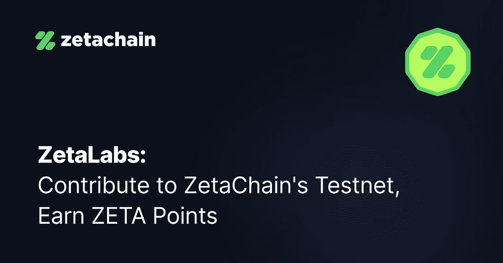

# ZetaLabs 是一个更可靠的加密网络的网关，现已推出。

> 原文：<https://medium.com/coinmonks/zetalabs-the-gateway-for-a-more-dependable-crypto-network-is-now-available-6a6322d05a42?source=collection_archive---------22----------------------->

[https://bit.ly/3AzVot2](https://bit.ly/3AzVot2)

> 跨链互操作的公式最终是否正确？
> 
> 简介
> 区块链技术的市场正在以令人难以置信的速度扩张；2021 年第二季度，其价值为 59.2 亿美元，预计从 2022 年到 2030 年，其复合年增长率(CAGR)将达到 85.9%。随着大多数…