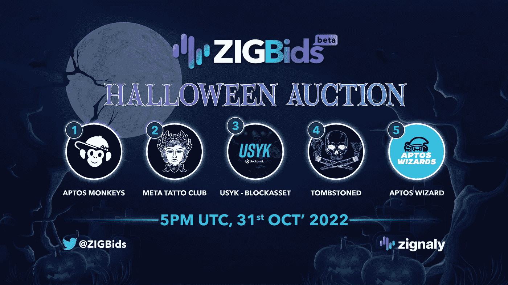
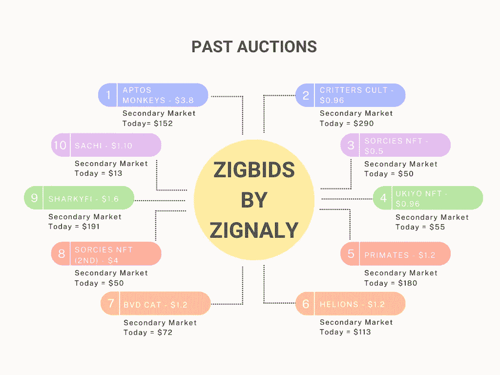
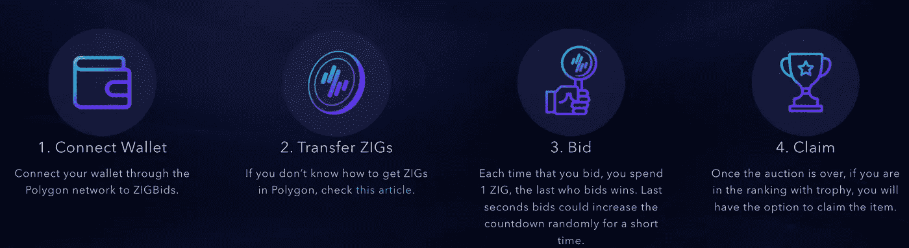

# zigbis——万圣节拍卖

> 原文：<https://medium.com/coinmonks/zigbids-the-halloween-auction-9c6beaaa648b?source=collection_archive---------23----------------------->

自从我上次在这里写[以来，Zignaly 的 igBids 一直在突飞猛进地发展。](/coinmonks/zigbids-by-zignaly-review-250cfc5fb8f0)

平台上的拍卖频率已经开始回升。该项目在 15 场拍卖中获得了 15 万多个出价，仅在过去一周，用户群就翻了一番。

这是纯粹的 NFT 阿尔法&迅速成为获取 NFT 白名单和预制 NFT 的最热门领域。只需查看以下预制 NFT 的拍卖价格&告诉我在加密领域的任何平台上可以以这些价格获得它们(为了便于比较，转换为美元):

今年万圣节，他们将举办一场盛大的拍卖，以下 NFTs 起价仅为 0.01 美元 ZIG:

*   Aptos 猴子——目前二级市场价格为 152 美元
*   Meta 纹身俱乐部——目前二级市场价格为 191 美元
*   USYK 块资产—当前二级市场价格为 96 美元
*   墓碑——当前二级市场价格为 84 美元
*   Aptos 向导—当前二级市场价格为 11 美元

# 如何加入竞拍？

*   进入 [ZigBids](https://zigbids.zignaly.com/) 网站；
*   连接您的多边形钱包；
*   制作您的个人资料；
*   将$ZIG 从您的钱包转移到 ZigBids
*   你是金子！

这里有一个视频[教程](https://youtu.be/2cDyJholLkc)让你入门。

> 此外，您可以点击“兑换代码”并输入“AHMEDZIGBIDSHWN22”，在您的 ZIGBids 帐户中获得高达 10，000 ZIG。尽情享受吧！

所以你走吧。我期待着看到你在即将到来的拍卖与你的战争箱的$ZIG 准备赢得。

祝你好运！

> 声明:帖子中的观点仅代表作者个人观点，不代表其雇主的观点，也不代表财务建议。在投资或使用帖子中提到的任何产品之前，请做好自己的研究。作者可能会也可能不会投资于任何特定的产品。

> 交易新手？尝试[加密交易机器人](/coinmonks/crypto-trading-bot-c2ffce8acb2a)或[复制交易](/coinmonks/top-10-crypto-copy-trading-platforms-for-beginners-d0c37c7d698c)