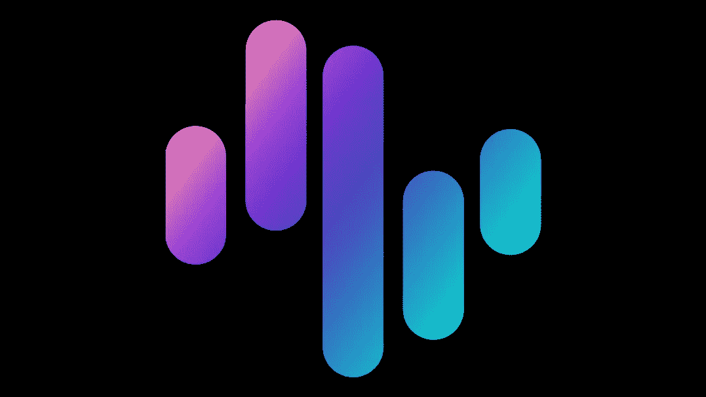

# 齐格纳里:对过去一周的反思

> 原文：<https://medium.com/coinmonks/zignaly-reflections-from-the-past-week-da733a29d0ea?source=collection_archive---------19----------------------->

# 推动透明度

在 SBF / FTX /阿拉米达内爆之后，培养对 Web3 生态系统的信任变得前所未有的重要。

在这方面，币安已经率先公开了自己的钱包以及其中的余额&现在正准备推出一种创新的储备证明模型。最终，默克尔树将按照赵昌鹏(CZ)重建信任的承诺加入行动。

我相信这些令人印象深刻的想法将有助于解决 Web3 空间内集中保管系统的透明度问题。虽然去中心化仍然是最终目标，但我发现 CZ 前几天在 Twitter Spaces AMA 上的观点是有价值的，为了行业的发展，我们有必要在新用户掌握自我监管架构之前，评估一下让他们加入 CEXs 有多容易。

在这方面，我发现这些发展对 Zignaly 也非常有益。关于管理的资产，社会投资平台是一种非托管服务。这是因为 Zignaly 只是一个服务提供商市场。他们不持有任何存在客户交易所账户(即币安)中的客户资金。

zing naly 的联合创始人 Abdul Rafay Gadit 在 Twitter 上直言不讳地要求 CZ 将储量证明扩展到币安经纪人计划的成员，zing naly 是该计划的主要参与者之一。

如果币安确实为其经纪人提供了这一功能，我相信这将增加 Zignaly 在加密社区中已经享有的信任。

# 利润分享 2.0 升级版

随着 beta 版面向精选社区成员推出，我有机会尝试新模块，并且不得不承认这是对当前系统的强大升级。

你可以在下面的链接中找到我的经历和截图。

Initial Twitter Thread

Follow up on 1st Twitter Thread

> 你对 Zignaly 的利润分成服务感兴趣吗？快进来在这个[环节](https://zignaly.com/app/signup/?invite=ahmedzig-)报名吧。最精彩的部分？没有最低金额限制！

# 总结想法

随着 Web3 / Crypto 领域经历一段极其艰难的时期，令人振奋的是 Zignaly 仍在继续发展。新的升级将大大增强整体用户体验，并提供新的功能，这将有助于该项目成为社会投资解决方案的领先提供商。

> 声明:帖子中的观点仅代表作者个人观点，不代表其雇主的观点，也不代表财务建议。在投资或使用帖子中提到的任何产品之前，请做好自己的研究。作者可能会也可能不会投资于任何特定的产品。

> 交易新手？试试[加密交易机器人](/coinmonks/crypto-trading-bot-c2ffce8acb2a)或者[复制交易](/coinmonks/top-10-crypto-copy-trading-platforms-for-beginners-d0c37c7d698c)