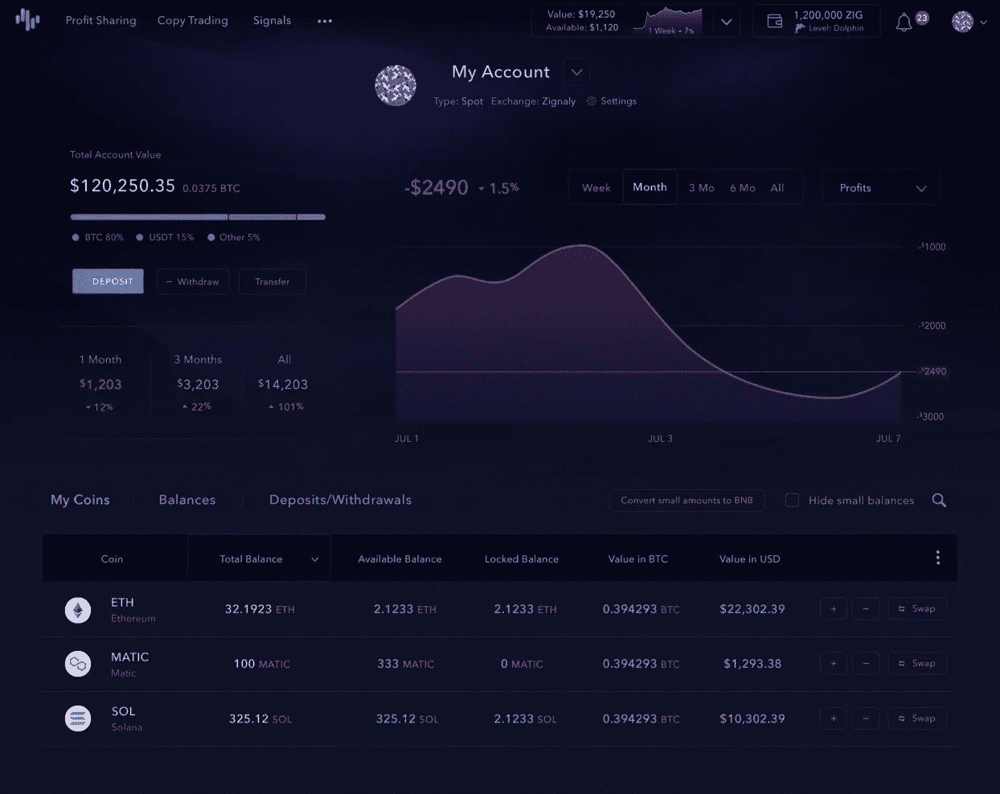

# Zignaly:利润分享 2.0 升级版

> 原文：<https://medium.com/coinmonks/zignaly-the-profit-sharing-2-0-upgrade-eaf94df645ae?source=collection_archive---------7----------------------->

Photo by [Brett Jordan](https://unsplash.com/@brett_jordan?utm_source=medium&utm_medium=referral) on [Unsplash](https://unsplash.com?utm_source=medium&utm_medium=referral)

尽管经历了熊市，但加密的社交投资平台 ignaly 并没有被吓倒。在过去的两个月里，我们看到了以下情况:

*   [推出](https://twitter.com/ahmed230418/status/1532728568685514753?s=20&t=a7jrH4QEQd9hsESJYxJl_w)改进他们的跳马项目；
*   [揭牌](https://twitter.com/ahmed230418/status/1539218235173789697?s=20&t=a7jrH4QEQd9hsESJYxJl_w)计划去 DeFi 化刀；
*   [宣布](https://twitter.com/ahmed230418/status/1544217010124607491?s=20&t=a7jrH4QEQd9hsESJYxJl_w)在比特币基地钱包上市；
*   [宣布与基于 Polygon 的 launch pad Kommunitas 合作；](https://twitter.com/ahmed230418/status/1551123769196007425?s=20&t=a7jrH4QEQd9hsESJYxJl_w)
*   [宣布](https://twitter.com/ahmed230418/status/1552717458523529219?s=20&t=a7jrH4QEQd9hsESJYxJl_w)在土耳其加密货币交易所 Bitci.com 上市。

> 你对 Zignaly 的利润分享服务感兴趣吗？进来[在此链接](https://zignaly.com/app/signup/?invite=ahmedzig)报名。最精彩的部分？没有最低金额限制！

然而，最引人注目的发展是[他们宣布升级到他们的利润分享市场，称为利润分享 2.0。据了解，他们要求提名一个候选人名单，以便在推出产品之前试用该产品。](https://twitter.com/ahmed230418/status/1552332966709174272?s=20&t=a7jrH4QEQd9hsESJYxJl_w)

回想一下，所有其他的产品、信号和复制交易，在这个公告发布之前都已经关闭了。该项目完全专注于利润分享，升级被吹捧为各个层面的突破。

那么，这一切都是为了什么呢？让我们来看看:

# ***全新的、改进的用户体验***

与任何产品的所有升级一样，利润分享 2.0 需要减少闲置时间。其目的是有一个大的“投资”按钮，以便尽可能方便投资者。

Image Credit: Zignaly

# ***将选项硬断开***

当前利润分享版本的一个问题是，投资者必须等待与他们共同投资的交易员平仓，才能与服务断开连接。

利润分享 2.0 将允许即时断开连接的能力。这意味着没有渐进式锁定期和高流动性。

# ***新的 API 连接特性***

任何市场都和它卖的产品一样好。就其平台上的交易者而言，Zignaly 更喜欢质量而不是数量。对他们来说不幸的是，将这些交易者从他们当前的基础设施转移到 Zignaly 的平台上玩游戏是一个障碍。

不会再有了。我们被告知，一个新的基于 API 的连接功能将允许这些顶级交易员使用的交易基础设施在 Zignaly 平台上提供利润分享服务。简而言之，这个平台将会看到一些顶级的交易者很快在 Zignaly 开店。

> 你知道吗？注册 Zignaly &用 100 美元连接任何利润分享服务，你就有资格获得以$ZIG 支付的 20 美元奖金。进来吧，[在此链接](https://zignaly.com/app/signup/?invite=ahmedzig)报名。

# 投资组合分配工具

Image Credit: Zignaly

灵活性是关键，尽管当前版本的利润分享允许投资者从不同的交易员中进行选择，但在不切断与特定交易员联系的情况下管理分配的能力相当有限。根据新的升级，投资者将能够:

1.  设定利润再投资分配；
2.  设置提款分配；
3.  减少对服务的分配，而无需断开连接。

# ***人性化服务***

对自动化投资选择最大的批评之一是缺乏与投资顾问的个人对话。这是 TradFi 行业的一个主要特点，长期以来一直被用来威胁以技术为中心的解决方案。

利润分享 2.0 将具有更多的社会联系和对话，这将允许交易者和他们的投资者之间更高的参与度。这个想法是使服务人性化，而不是把它们当作机器人。

# 性能展示的改进

选择下一个共同投资的交易者不应该仅仅基于过去的回报。需要对所遵循的战略有高度的可见性，并在风险调整的基础上进行业绩介绍。

Image Credit: Zignaly

虽然现有的系统解决了这些问题，但利润分享 2.0 将更进一步，使绩效演示更加详细，在视觉上更容易理解。

> Zignaly 对所有人都是公平的金融。让一个专业的交易者管理你的密码，而你可以高枕无忧。最重要的是，如果交易者让你获利，你只需支付成功费！进来[在此链接](https://zignaly.com/app/signup/?invite=ahmedzig)报名。

# 结论

我对这次升级感到非常兴奋，作为一个跟踪这个项目有一段时间的人，我可以看到这是如何融入整体计划的，特别是转换到“道”和将 TVL 增加到 100 亿美元。

不是财务建议，但 Zignaly 正在迅速建设成为一个顶级项目在不久的将来！

> 进来[在此链接](https://zignaly.com/app/signup/?invite=ahmedzig)注册，今天就开始吧！

> **免责声明:**本文观点仅代表作者个人观点&不代表其雇主的观点，也不代表财务建议。在投资或使用文中提到的任何产品之前，请做好自己的研究。作者可能会也可能不会投资于任何特定的产品。

> 交易新手？试试[密码交易机器人](/coinmonks/crypto-trading-bot-c2ffce8acb2a)或[复制交易](/coinmonks/top-10-crypto-copy-trading-platforms-for-beginners-d0c37c7d698c)