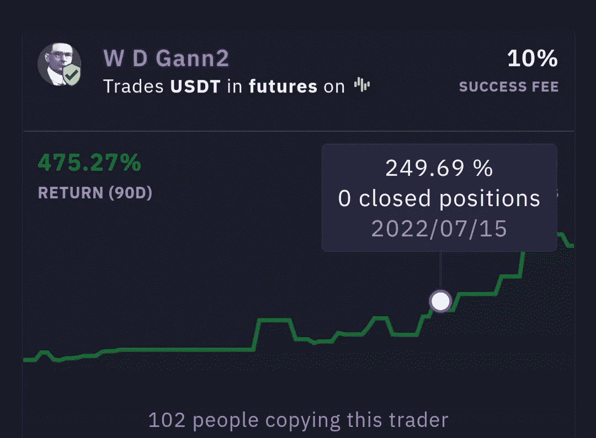
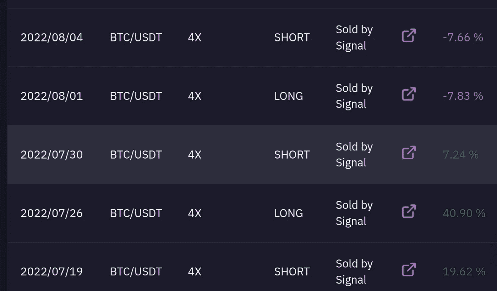

# Zignaly 交易员简介—第 1 期

> 原文：<https://medium.com/coinmonks/zignaly-trader-profile-issue-1-d5d6753a9802?source=collection_archive---------25----------------------->

Photo by [Adam Nowakowski](https://unsplash.com/@adamaszczos?utm_source=medium&utm_medium=referral) on [Unsplash](https://unsplash.com?utm_source=medium&utm_medium=referral)

最近，我一直在推特上谈论 Zignaly 上的一些交易者，他们认为他们的回报绝对是疯狂的。

因为我总是在 Medium 上寻找新的内容来帮助你在 Zignaly 的社会投资革命中跳跃，所以我决定让它成为一个固定的专题。

# **推出 Zignaly 交易员档案**

从现在开始，期待一篇关于 Zignaly 顶级和/或令人兴奋的交易者的文章，每月至少一次。我们将通过谈论他们的回报概况、战略和业绩归因来尽量保持简单。

> 你对 Zignaly 的利润分成服务感兴趣吗？快来报名参加这个[环节](https://zignaly.com/app/signup/?invite=ahmedzig-)。最精彩的部分？没有最低金额限制！

# **第一份 Zignaly 交易者简介— WD GANN**

WD Gann 是 Zignaly 市场上的一名匿名交易者，他令人印象深刻的回报吸引了我的眼球(稍后会有更多相关内容)。他主要在币安交易 USDT 期货& Zignaly 用户可以选择与他共同投资，并根据成功收取费用。他经营着两家名为 WD Gann 1 和 WD Gann 2 的利润分享服务公司。正是后者引起了我的注意，并将成为我们审查的主题:

**返回剖面图**

给你。截至本文的第一天，这位交易员在过去 90 天里创造了 475.27%的巨大回报。考虑到相当低的成功费用，这是 1，711%的年利率。

换句话说，如果你在 90 天前向他投资 1 美元，在支付他的 10%后，你的账户余额将是 427.7 美元！

> 你知道吗？注册 Zignaly &用 100 美元连接任何利润分享服务，你就有资格获得以$ZIG 支付的 20 美元奖金。快进来在这个[环节](https://zignaly.com/app/signup/?invite=ahmedzig-)报名吧。

**策略**

WD 江恩 2 没有告诉我们太多关于他的确切策略，但我们从他的简介中了解到，他是江恩的学生，利用经验数据和江恩的教导，开发了一个算法交易模型。这个模型给他做多或做空的信号，以及何时平仓。依我拙见，江恩技术本身似乎是道听途说(占星术和古代数学)，但不管它是什么，这个家伙已经弄明白了。

Last 5 Trades

我喜欢这个交易者的一点是简单。他一次只开立一个头寸，如果投资者希望这样做，就可以断开连接(记住，随着利润分享 2.0 的升级，这将不是一个问题)。此外，相当低的成功费用之谜是，这家伙是一个人的人。他在 Zignaly marketplace 的个人资料页面上声明，他将根据回报继续调整(更高的回报意味着他可以接受更低的百分比)。他真是太好了！

> Zignaly 对所有人都是公平的金融。让一个专业的交易者管理你的密码，而你可以高枕无忧。最重要的是，如果交易者让你获利，你只需支付成功费！快进来在这个[环节](https://zignaly.com/app/signup/?invite=ahmedzig-)报名吧。

**表现归因**

这个交易者在过去的 90 天里虔诚地做多和做空 BTC / USDT 期货。在此期间，市场波动剧烈，美元 BTC 价格大幅下跌，随后价格波动区间波动。

因此，尽管过去 90 天的部分回报可能是由市场普遍下跌推动的，但交易员的抄底策略非常出色。

女士们先生们，这不是侥幸。

# 结论

我希望你喜欢这篇文章&我已经激励你今天就和 Zignaly 一起开始你的被动收入之旅。

如果是这样的话，那就来吧，在这个[链接](https://zignaly.com/app/signup/?invite=ahmedzig-)上报名，从今天开始吧！

> **免责声明**:文中观点仅代表作者个人观点&不代表其雇主的观点，也不代表财务建议。在投资或使用帖子中提到的任何产品之前，请做好自己的研究。作者可能会也可能不会投资于任何特定的产品。

> 加入 Coinmonks [电报频道](https://t.me/coincodecap)和 [Youtube 频道](https://www.youtube.com/c/coinmonks/videos)了解加密交易和投资

# 另外，阅读

*   [KuCoin vs 北海巨妖 vs BitYard](https://coincodecap.com/kucoin-vs-kraken-vs-bityard)
*   [加密交易的最佳 VPN](https://coincodecap.com/best-vpns-for-crypto-trading)
*   [印度最佳 P2P 加密交易所](https://coincodecap.com/p2p-crypto-exchanges-in-india) | [柴犬钱包](https://coincodecap.com/baby-shiba-inu-wallets)
*   [八大加密附属计划](https://coincodecap.com/crypto-affiliate-programs) | [eToro vs 比特币基地](https://coincodecap.com/etoro-vs-coinbase)
*   [最佳以太坊钱包](https://coincodecap.com/best-ethereum-wallets) | [电报上的加密货币机器人](https://coincodecap.com/telegram-crypto-bots)