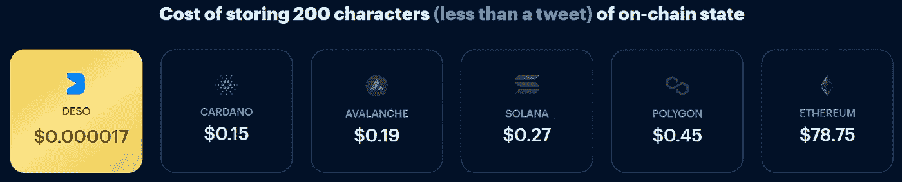
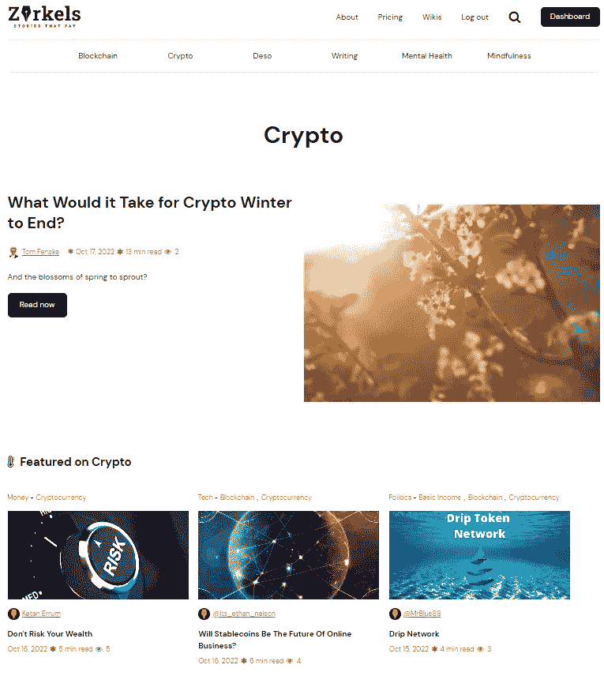
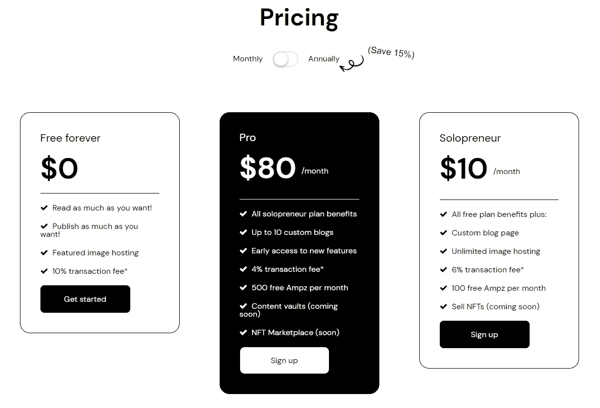

# Zirkels 赚取 DeSo 博客

> 原文：<https://medium.com/coinmonks/zirkels-earn-deso-blogging-4aef2546b1f8?source=collection_archive---------35----------------------->

DeSo 区块链被低估，不被重视。DeSo 是社交区块链的未来，如果你留下来，我将向你解释这个区块链项目拥有的力量。它不仅仅是一个应用程序或网站。这是一个巨大的项目，充满了多个较小的项目，所有这些项目以无缝和简单的方式连接在一起。

我知道这篇文章是关于 DeSo 博客的，但是在我进入 DeSo 博客平台之前，我想给你一些关于 DeSo 的信息。

DeSo 区块链由 Nader Al-Naji 于 2019 年初创建。起价大约是 178 美元，现在已经降到了 15 美元。这并不意味着这个项目失败了，这只是意味着这个项目在最初发行时卖得很好，当价格高的时候人们就退出了。现在价格一直在稳步上涨。至少我认为事情是这样的。

DeSo 拥有一些最低的天然气费用，这使其成为社交媒体集成的最佳区块链项目之一。与以太坊、多边形、索拉纳、雪崩和卡尔达诺相比，它在速度和费用上遥遥领先。

正如你在上面的图片中看到的，汽油费与任何其他区块链项目都不一样。我是 ETH 的忠实粉丝，但如果他们不解决天然气费问题，那么 DeSo 等项目将会彻底击败他们，越来越多的人将会迁移到 DeSo 等区块链项目。

DeSo 是唯一一个可以通过将金融原语与廉价内容存储相结合来支持无限状态应用的区块链。无限状态的应用程序会随着每个事务生成新的数据，这些数据必须被存储和索引。例如，社交应用程序会根据每个帖子、赞、关注等生成数据

现在我已经解释了 DeSo 的力量，我想看看你如何使用这个区块链赚钱，以及它回馈给人们的力量。

我想从一个在 DeSo 区块链上的博客项目开始。在我看完这个项目后，我将分享一个简短的列表，其中包括 DeSo 区块链上的其他项目，您可以使用这些项目来获得 DeSo，并成为这个新兴区块链项目的一部分。

# [齐尔克尔斯](https://zirkels.com/u/1665660650086x871858339760202200)

[Zirkels](https://zirkels.com/u/1665660650086x871858339760202200) 是 DeSo 区块链上的一个博客项目。我敢肯定，很多加密界的人听说过其他加密网站的博客，如 [read.cash](https://read.cash/r/HattyHats) (赚 BCH)[publishax](https://www.publish0x.com/?a=YQdJrqJdOG)(赚 ETH 和 AMPL)[Steemit](https://steemit.com/@hattyhats)(赚 STEEM)，还有更多，但我发布的是一些顶级的加密博客网站。所有这些网站都很棒，值得一看，但 Zirkels 更棒，因为它是 DeSo 区块链上的第一个博客项目。它很容易使用，并与您的 DeSo 帐户连接，并允许任何使用 DeSo 的人很容易看到您的文章，并喜欢和奖励，如果他们觉得这是值得的。所以让我们来看看为什么我认为随着时间的推移，Zirkels 会成为一个巨大的博客网站。

在开始使用 [Zirkels](http://zirkels.com/?ref=HattyHats) 之前，您需要创建一个 DeSo 帐户。一旦你使用 Diamond、Desofy、Desocialworld 和 DeSo Blockchain 上的几个其他平台创建了你的帐户，你就可以去 [Zirkels](http://zirkels.com/?ref=HattyHats) 并开始发布你的文章。

以上是我在 [Zirkels](http://zirkels.com/?ref=HattyHats) 上发布的一篇文章。我从这篇文章中赚了 1 美元。这可能看起来不是很多，但当我发布这篇文章时，我才开始使用这个平台。这也不全是关于你赚的钱。它是关于为你自己创造一个名字，创造人们喜欢阅读的内容。过一段时间，你会开始赚更多的钱，最终一切都是值得的。此外，如果你不喜欢写作和创作内容，那么我建议你另找一个爱好。我这样说是因为有时候你不会从你的内容中获得任何东西。这可能会让很多人感到不安，因为你投入了大量的时间来创建你的内容。这就是为什么我说，如果你想进入这种类型的内容创作，你应该享受写作。如果你什么也没做，至少你喜欢写作和研究。

登录后，很容易就能习惯网站的工作方式。你可以查看已经写好的文章，通过关注或奖励 DeSo 来帮助支持人们。

或者，您可以使用 [Zirkels](http://zirkels.com/?ref=HattyHats) 易于使用的界面开始创建自己的内容。

使用 [Zirkels](http://zirkels.com/?ref=HattyHats) 是免费的，但你可以选择支付会员费来获得一些额外的优惠，如每月 Ampz，更低的交易费，自定义博客页面，早期访问新功能，以及更多取决于你选择升级到 pro 还是 Solopreneur。

目前我使用的是永久免费选项，但计划随着时间的推移进行升级。我正在保存我目前赚的密码，但是如果我最终从 [Zirkels](http://zirkels.com/?ref=HattyHats) 开始每月赚超过 10 美元，我将升级到 Solopreneur，如果我最终每月赚超过 80 美元，我将升级到 Pro 版本。我不确定月薪超过 80 美元是否会发生，但如果发生了，我会投资这个平台，并表示我的支持。

如果您想了解更多信息并观看 [Zirkels](http://zirkels.com/?ref=HattyHats) 的演示，请观看本文开头的视频。

以下是 DeSo 区块链上的一些最佳项目列表

[钻石](https://diamondapp.com/u/HattyHats?tab=posts)

[Zirkels](http://zirkels.com/?ref=HattyHats)

[NFTz](https://nftz.me/u/HattyHats/created)

[BitClout](https://bitclout.com/u/HattyHats?tab=posts&feedTab=Following)

[解冻](https://www.desofy.app/)

我希望每个人都喜欢我的文章，并花一秒钟来看看 DeSo 区块链和 [Zirkels](http://zirkels.com/?ref=HattyHats) 。DeSo 可以提供很多东西，Zirkels 只是这个令人惊叹的项目的一小部分。

请喜欢、关注、分享这篇文章，帮助我成长。

查看我的网站，了解更多赚取和学习加密的方法！

哈蒂的小屋

原文在 [read.cash](https://read.cash/@HattyHats/zirkels-earn-deso-blogging-ab872eea)

> 交易新手？试试[加密交易机器人](/coinmonks/crypto-trading-bot-c2ffce8acb2a)或者[复制交易](/coinmonks/top-10-crypto-copy-trading-platforms-for-beginners-d0c37c7d698c)