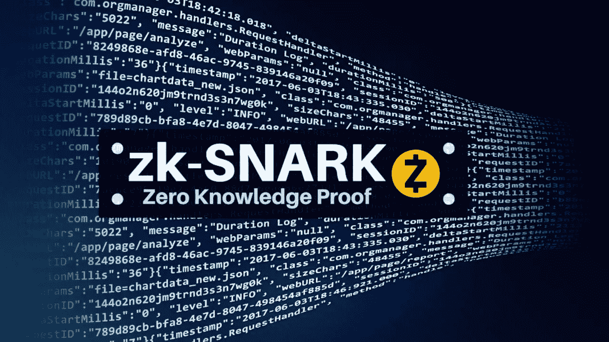
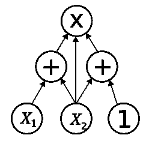
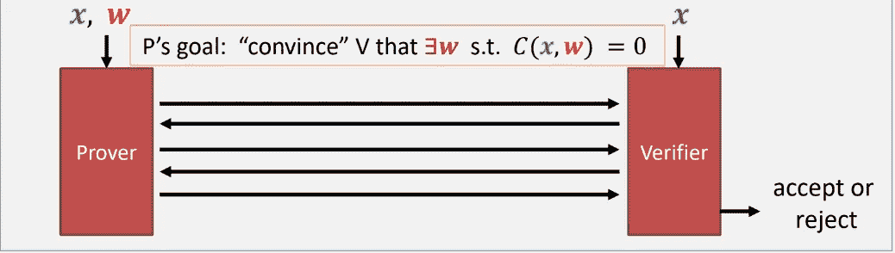
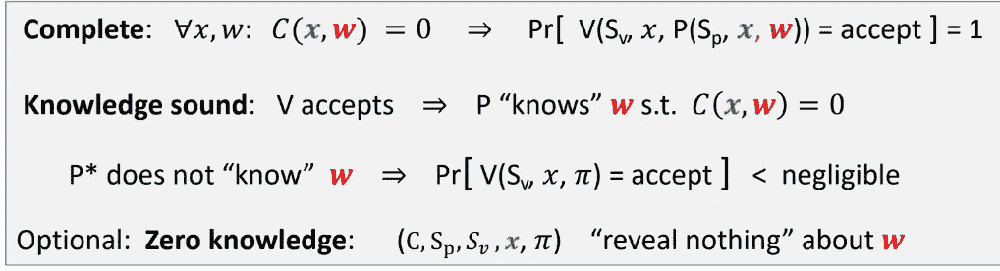
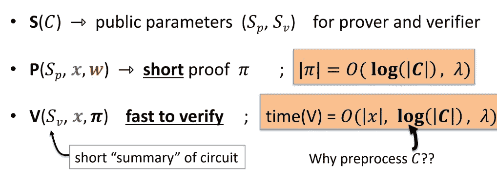
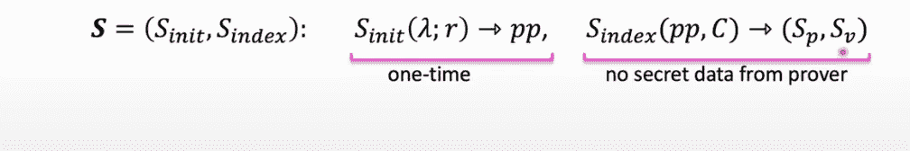
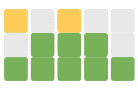

# ZK-斯纳克——一个小介绍

> 原文：<https://medium.com/coinmonks/zk-snark-a-small-introduction-26f00284ba40?source=collection_archive---------10----------------------->

zk -Snark

# 蜗鲨

Snark 是证明一个陈述的一种简便方法。我想表明我知道信息的内容，而不告诉确切的内容，也称为零知识 snark

SNARK 又短又快，无法验证。

ZK·斯纳克用于公共区块链的私人交易

# SNARK 的使用案例

**公开区块链的私人交易** : Tornado cash、Zcash、IronFish

**合规**:

偿付能力和合规性的私人证明

**可扩展性**:批量添加交易的汇总系统，你可以使用 ZK SNARKS 进行验证

# ZK 定理是如何被证明的

重要概念

1.  **算术电路**:执行算术运算的逻辑门

Arithmetic Circuit

所以我们称之为 C(h，m)的东西，只有当 SHA256(m)=h 时输出才会为零，否则就不会为零

1.  **论证系统**:

C(x，w) → F x=陈述 w=见证

我们有将 x，w 作为输入的证明者，也有仅将 x 作为输入的验证者，现在证明者的工作是说服验证者 x 有 w，使得 C(x，w)将为零。

Interactive Argument System

预处理论证系统

它本质上是非交互式的。它创建一个设置，该设置反过来产生公共参数

S(C) → (Sp，Sv)

证明者将获得 x，w 和 Sp，验证者将获得 Sv 和 v，现在将提供一个名为 pie 的证明，这个证明 pie 是证明者和验证者之间唯一的交互。

所以这个系统将有三个算法(S，P，V):

S(C)→将输出(Sp，Sv)给校准仪和校验器

P(Sp，x，w) →将输出证明 pi

V(Sv，x，pi)→将返回接受或拒绝

对论证系统的非正式要求很少:

1.  完全:意味着如果证明者能够提供证明，验证者将接受概率为 1 的证明。
2.  知识声音:证明者必须知道它的证人，如果它不知道，那么验证者接受证据的机会应该可以忽略不计。这里知道 w 可以从证明者中提取出来。
3.  零知识:证明者不应该透露任何关于证人的信息

从数学上讲，它可以写成如下形式:

Requirements for Argument System

SNARK—**S**succint**AR**Kknowledge

与论证系统的概念相同，但具有易于验证的简短证明。

如果我们想了解 SNARK，它基本上证明证人，而不显示它，证明是短暂的，可以很容易地验证。秘密，简短和快速，这是利用预处理器 C 的对数函数实现的

SNARK Proof

预处理设置的类型

1.  **每个电路的可信设置:**使用一些秘密随机比特为每个电路单独创建公共参数，并且在每次创建之后，需要销毁这些随机比特，因为证明者可以使用它来证明虚假陈述。
2.  **可信但通用(可更新)的设置**:随机秘密位 r 独立于电路，并且只产生一次，可以被不同的电路用来创建它们的公共参数。

3.**透明设置**:仅使用电路，不需要任何秘密随机位。

# 零知识是如何工作的

Wordle 是目前非常流行的游戏，所以你如何证明你已经解决了挑战，而不告诉确切的挑战或答案。通过分享这张照片

Wordle success image

因此，假设证明者与验证者共享该图像，表明交易是有效的，并且验证者已经知道该图像意味着有效的交易，因此甚至不向验证者公开任何内容，证明者就可以验证该交易。

这是我对在 [zkhack 白板上给出的精彩解释的理解。](https://zkhack.dev/whiteboard/module-one/)一定要退房！！