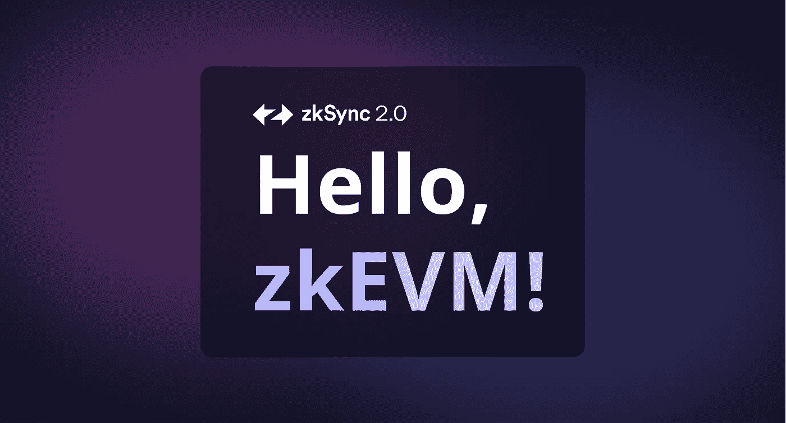

# ZkSync，以太坊的终极扩展解决方案？

> 原文：<https://medium.com/coinmonks/zksync-the-ultimate-scaling-solution-for-ethereum-5f64ffc0c490?source=collection_archive---------14----------------------->

非常好的加密读者，在本文中，我们将讨论 ZkSync，一个以太坊扩展解决方案，旨在构建最终符合 EVM 的 ZK 卷(zkEVM)。目前有几个项目正在尝试开发这项技术，但是，ZkSync 提供了一些可以使它处于领先地位的功能，让我们分析其中的一些要点，看看它的技术是否像…