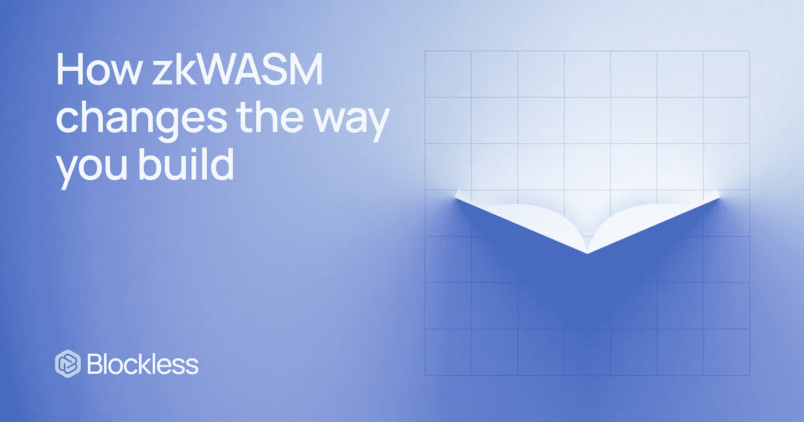

# zkWASM 将改变你的建筑方式

> 原文：<https://medium.com/coinmonks/zkwasm-will-change-the-way-you-build-8176dc4fdaee?source=collection_archive---------2----------------------->

> 我们很高兴推出无块 ZK——一个 zk-SNARK 的“证明者即服务”功能，用于部署在无块上的 WASM 执行。

无阻塞的愿景是创造一个未来，开发者可以在一个分散的全球网络上轻松构建和发布**高性能**和**无信任**应用。带着这个目标，团队和社区一直在研究和思考如何加速这个未来的轨迹。

虽然**无块功能**于【2022 年 10 月发布并继续完善，但通用执行平台已允许我们推出直接满足开发人员需求的解决方案产品。

在开发人员社区所要求的特性中，一种更好的生成 zk-SNARK 证明的方法排在列表的首位。

目前，在行业中，开发人员面临着两个需要解决的主要难题:

1.今天构建一个零知识服务或应用程序需要**大量的体力劳动和领域专业知识**。作为构建者，您必须将遗留的业务逻辑和代码基础转换成 Circom、Halo2 和 Cario 等语言的 ZK 电路。

2.zk-SNARK 证明是计算密集型的，通常需要特殊且昂贵的硬件来执行。管理这样的专用硬件会分散团队对核心业务逻辑的关注。

今天，我们很高兴地推出无块 ZK，这是一个 ZK-SNARK "**prover as a service**"功能，用于部署在无块上的 WASM 执行，为所有在无块基础上构建的构建者解决了上述障碍。

作为一名开发者，你现在可以用你喜欢的语言创建 **zk 驱动的**服务和应用**，就像你通常通过无阻塞函数所做的那样。在部署 WASM 函数二进制文件时，只需通过无阻塞仪表板或无阻塞 CLI 打开 ZK 证明器功能。当您的函数收到请求时，在函数执行的同时，无阻塞工作器将使用相关的输入模拟函数，并生成一个 zk-SNARK 证明，保证**执行的正确性**。然后，zk-SNARK 证明可以被聚合并发送到任何目的地 L1 或数据可用性层进行验证。**

在后台，无阻塞 zk 利用 [zkWASM](https://github.com/DelphinusLab/zkWasm) ，一个 **zk-SNARK 电路/证明生成器**，允许开发人员创建支持 ZK 的 dApps，其执行可以根据需要进行验证。您的 WASM 执行仍然可以用多种语言编写，当函数在无块上执行时，将自动生成一个 ZK 证明。这个强大的零知识电路生成引擎可以翻译你的 WASM 字节码在任何 WASM 兼容的语言，并生成与 CPU 或 GPU 的 ZK 电路。未来，**性能增强 SDK** 也将发布，以更好地帮助构建者开发和发布具有优化的验证生成性能和最小运营成本的可验证 dApps。

我们非常高兴通过 Blockless 和 Delphi NUS Lab,**zkWASM**的创造者之间的独家合作，将无块 ZK 功能带到我们的开发人员社区。想了解更多关于这次合作的信息，请看这篇[文章](https://blockless.medium.com/blockless-delphinus-lab-zkwasm-exclusive-partnership-319263e41692)。

Blockless 和 Delphinus 实验室很高兴在 2022 年第四季度末首次展示一个 **zkWASM 游乐场**。2023 年，Q1 将发布《无屏蔽 ZK》的公开版。这些团队相信，无阻塞的 ZK 为 Web3 社区带来了一个充满机遇的世界。与此同时，更广泛的 WASM 和 Web2 开发者社区也可以使用无阻塞 zk 作为切入点，直接参与 ZK 支持的 Web3 运动。

加入我们，成为旅程的一部分。

**关于无阻塞**

无块是基于 WASM 的可定制执行层，支持分散式无服务器应用。

作为一个无许可的网络，无阻塞允许网络参与者贡献各种硬件资源，从 Android 设备到高性能服务器。开发人员可以在无块基础上构建无与伦比的规模、可靠性和安全性。

[网站](https://blockless.network/) | [推特](https://twitter.com/theblockless) | [不和](https://t.co/VpuD8y3jy9) | [电报](https://t.co/QaenX4FIBH) | [媒体](https://blockless.medium.com/) | [镜像](https://mirror.xyz/0x4322b89aEd9ab7d2D4D3e6772B7c91765eba875B) | [Linkedin](https://www.linkedin.com/company/blockless)

**关于德尔福纳斯实验室**

Delphinus Lab 是一个澳大利亚研发团队，专注于 zk-SNARK 技术。Delphinus 是 zkWASM 库的创建者。

[Github](https://github.com/DelphinusLab) | [网站](https://delphinuslab.com) | [zkWASM](https://github.com/DelphinusLab/zkWasm)

> 交易新手？在[最佳加密交易](/coinmonks/crypto-exchange-dd2f9d6f3769)上尝试[加密交易机器人](/coinmonks/crypto-trading-bot-c2ffce8acb2a)或[复制交易](/coinmonks/top-10-crypto-copy-trading-platforms-for-beginners-d0c37c7d698c)